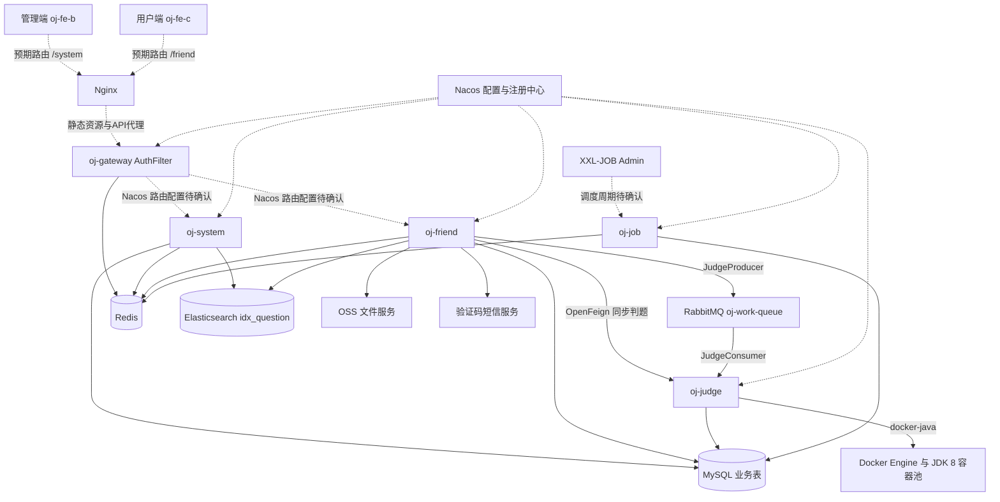
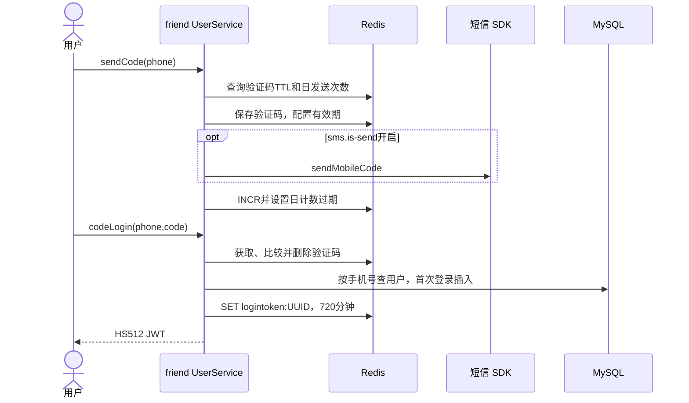
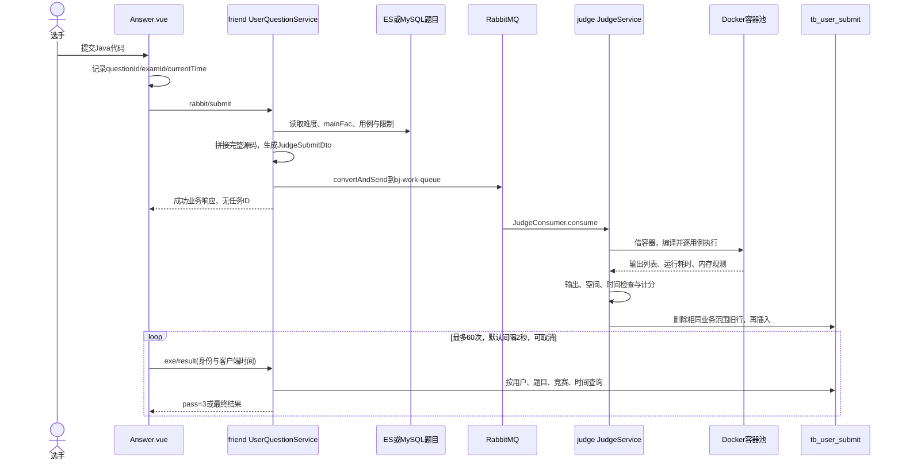
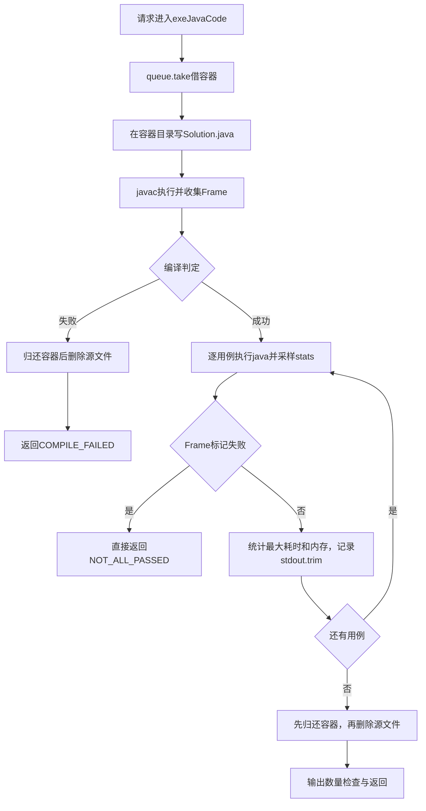
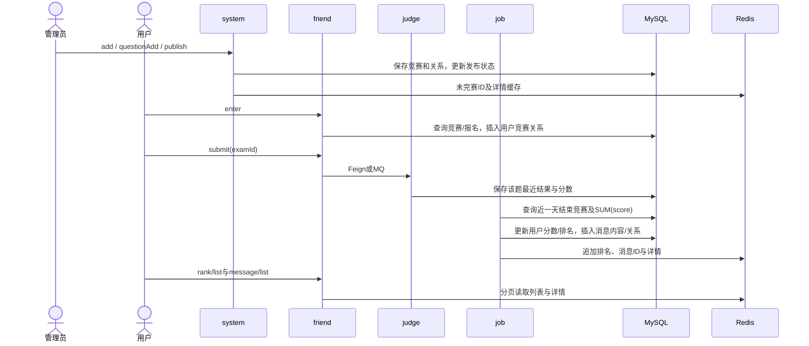
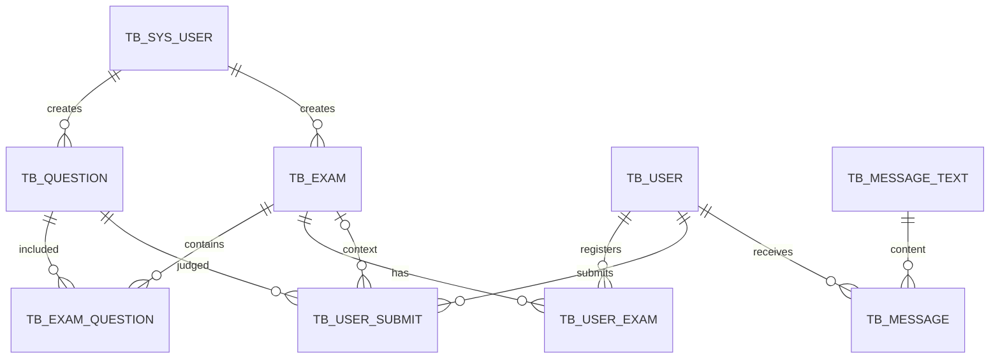

# Algo Arena OJ 项目

> 
> **证据边界**：本报告来自当前工作区静态源码分析，覆盖 18 个 Maven POM、200 个 Java 文件（含 2 个公共 Redis 测试）、9 个 Mapper XML、数据库脚本、部署配置，以及两端前端的路由、请求适配和关键业务逻辑。未启动服务、调用短信/OSS、执行 SQL、压测或修改业务代码。配置中的凭据、令牌和密钥不作明文记录。仓库之外的 Nacos 配置、XXL-JOB 调度规则和真实数据库状态均标为“待确认”。
>
> **阅读约定**：`B = alog-arena-oj/`，`M = B/oj-modules/`，`C = B/oj-common/`，`V = vuepro/oj/`。正文以类名和文件名链接对应源码，并给出关键方法。同名 Service 以所属模块区分。图中的实线表示源码已实现的调用，虚线表示外部配置/部署意图待确认。

## 第一章：项目整体介绍

### 1.1 项目名称、定位与背景

根 README 将项目命名为 **algo-arena-OJ**，说明其为微服务在线 OJ 系统。后端目录和 Maven artifactId 实际拼写是 `alog-arena-oj`，文档保留这一真实路径。业务定位是集成题库练习、Java 自动判题、竞赛管理、报名和赛后结果通知的算法学习平台。

从 Controller、提交服务和任务处理器可以确认系统解决了三类问题：管理者如何维护题目及竞赛；选手如何提交代码并查看评测；赛后如何批量计算分数和通知用户。**开发背景推测**：项目适合算法训练或校园竞赛场景，但仓库没有产品需求书、用户规模、上线记录及个人分工证据，不能认定已经服务真实学校或商业客户。[QuestionServiceImpl.java](D:/Codex/.codex/worktrees/dc60/algo-arena-oj/alog-arena-oj/oj-modules/oj-system/src/main/java/com/oj/system/service/question/impl/QuestionServiceImpl.java) [ExamServiceImpl.java](D:/Codex/.codex/worktrees/dc60/algo-arena-oj/alog-arena-oj/oj-modules/oj-system/src/main/java/com/oj/system/service/exam/impl/ExamServiceImpl.java) [UserQuestionServiceImpl.java](D:/Codex/.codex/worktrees/dc60/algo-arena-oj/alog-arena-oj/oj-modules/oj-friend/src/main/java/com/oj/friend/service/user/impl/UserQuestionServiceImpl.java) [ExamXxlJob.java](D:/Codex/.codex/worktrees/dc60/algo-arena-oj/alog-arena-oj/oj-modules/oj-job/src/main/java/com/oj/job/handler/ExamXxlJob.java)

### 1.2 已实现的核心功能

| 业务 | 实际实现 |
|---|---|
| 管理员 | 账号密码登录、创建管理员、退出、查询当前身份 |
| 普通用户 | 手机验证码登录，首次登录自动注册，个人资料和头像更新 |
| 题库 | 管理端增删改查；C 端 ES 搜索、详情、热门题目、前后题导航 |
| 判题 | Java 代码拼接、Docker 编译和逐用例执行、结果比对、分数落库 |
| 异步提交 | RabbitMQ 工作队列消费判题；前端轮询结果 |
| 竞赛 | 创建、组题、编辑、发布、撤销、报名、题目切换、赛后排名 |
| 消息 | 赛后任务生成站内信，C 端分页查询 |
| 文件 | OSS 上传、按用户计数限额、头像信息更新 |

证据：`SysUserController`、各业务 Controller；`UserQuestionServiceImpl#submit/rabbitSubmit`；`ExamXxlJob#createMessage`。[SysUserController.java](D:/Codex/.codex/worktrees/dc60/algo-arena-oj/alog-arena-oj/oj-modules/oj-system/src/main/java/com/oj/system/controller/sysuser/SysUserController.java) [UserQuestionServiceImpl.java](D:/Codex/.codex/worktrees/dc60/algo-arena-oj/alog-arena-oj/oj-modules/oj-friend/src/main/java/com/oj/friend/service/user/impl/UserQuestionServiceImpl.java) [ExamXxlJob.java](D:/Codex/.codex/worktrees/dc60/algo-arena-oj/alog-arena-oj/oj-modules/oj-job/src/main/java/com/oj/job/handler/ExamXxlJob.java) [UserMessageServiceImpl.java](D:/Codex/.codex/worktrees/dc60/algo-arena-oj/alog-arena-oj/oj-modules/oj-friend/src/main/java/com/oj/friend/service/user/impl/UserMessageServiceImpl.java) [OSSService.java](D:/Codex/.codex/worktrees/dc60/algo-arena-oj/alog-arena-oj/oj-common/oj-common-file/src/main/java/com/oj/file/service/OSSService.java)

### 1.3 技术栈及实际用途

| 技术 | 仓库版本/声明 | 实际用途与证据 |
|---|---|---|
| Java | 后端 source/target 17；沙箱默认 JDK 8 镜像 | 服务开发使用 Java 17，用户代码运行兼容性按 JDK 8 考虑。[alog-arena-oj/pom.xml](D:/Codex/.codex/worktrees/dc60/algo-arena-oj/alog-arena-oj/pom.xml) [DockerSandboxPoolConfig.java](D:/Codex/.codex/worktrees/dc60/algo-arena-oj/alog-arena-oj/oj-modules/oj-judge/src/main/java/com/oj/judge/config/DockerSandboxPoolConfig.java) |
| Spring Boot | 3.0.1 | Web 服务、依赖注入、自动配置、参数校验。[alog-arena-oj/pom.xml](D:/Codex/.codex/worktrees/dc60/algo-arena-oj/alog-arena-oj/pom.xml) [oj-modules/pom.xml](D:/Codex/.codex/worktrees/dc60/algo-arena-oj/alog-arena-oj/oj-modules/pom.xml) |
| Spring Cloud / Alibaba | 2022.0.0 / 2022.0.0.0-RC2 | Gateway、LoadBalancer、OpenFeign、Nacos。[alog-arena-oj/pom.xml](D:/Codex/.codex/worktrees/dc60/algo-arena-oj/alog-arena-oj/pom.xml) |
| MyBatis-Plus / PageHelper | 3.5.5 / 2.0.0 | CRUD、ASSIGN_ID、审计填充；XML 查询分页。[MyMetaObjectHandler.java](D:/Codex/.codex/worktrees/dc60/algo-arena-oj/alog-arena-oj/oj-common/oj-common-mybatis/src/main/java/com/oj/mybatis/MyMetaObjectHandler.java) [QuestionServiceImpl.java](D:/Codex/.codex/worktrees/dc60/algo-arena-oj/alog-arena-oj/oj-modules/oj-system/src/main/java/com/oj/system/service/question/impl/QuestionServiceImpl.java) |
| MySQL | Compose 声明 8.0.46 | 题目、竞赛、用户、结果、消息的关系数据。[script.sql](D:/Codex/.codex/worktrees/dc60/algo-arena-oj/alog-arena-oj/script.sql) [docker-compose.yml](D:/Codex/.codex/worktrees/dc60/algo-arena-oj/alog-arena-oj/deploy/test/docker-compose.yml) |
| Redis / Fastjson2 | Redis `latest`；Fastjson2 2.0.43 | 身份会话、验证码、计数、列表和详情缓存。[CacheConstants.java](D:/Codex/.codex/worktrees/dc60/algo-arena-oj/alog-arena-oj/oj-common/oj-common-core/src/main/java/com/oj/common/constants/CacheConstants.java) [RedisService.java](D:/Codex/.codex/worktrees/dc60/algo-arena-oj/alog-arena-oj/oj-common/oj-common-redis/src/main/java/com/oj/redis/service/RedisService.java) [RedisConfig.java](D:/Codex/.codex/worktrees/dc60/algo-arena-oj/alog-arena-oj/oj-common/oj-common-redis/src/main/java/com/oj/redis/config/RedisConfig.java) |
| RabbitMQ | Compose 3.8.30-management | 持久工作队列 `oj-work-queue`，异步判题。[RabbitConfig.java](D:/Codex/.codex/worktrees/dc60/algo-arena-oj/alog-arena-oj/oj-common/oj-common-rabbitmq/src/main/java/com/oj/rabbit/config/RabbitConfig.java) [JudgeProducer.java](D:/Codex/.codex/worktrees/dc60/algo-arena-oj/alog-arena-oj/oj-modules/oj-friend/src/main/java/com/oj/friend/rabbit/JudgeProducer.java) [JudgeConsumer.java](D:/Codex/.codex/worktrees/dc60/algo-arena-oj/alog-arena-oj/oj-modules/oj-judge/src/main/java/com/oj/judge/rabbit/JudgeConsumer.java) |
| Docker / docker-java | docker-java 3.3.4；Engine 版本待确认 | 容器池、代码目录挂载、编译执行和资源统计。[SandboxPoolServiceImpl.java](D:/Codex/.codex/worktrees/dc60/algo-arena-oj/alog-arena-oj/oj-modules/oj-judge/src/main/java/com/oj/judge/service/impl/SandboxPoolServiceImpl.java) [DockerSandboxPool.java](D:/Codex/.codex/worktrees/dc60/algo-arena-oj/alog-arena-oj/oj-modules/oj-judge/src/main/java/com/oj/judge/config/DockerSandboxPool.java) |
| XXL-JOB | 2.4.0 | 三个任务 Handler，执行器连接独立调度中心。[ExamXxlJob.java](D:/Codex/.codex/worktrees/dc60/algo-arena-oj/alog-arena-oj/oj-modules/oj-job/src/main/java/com/oj/job/handler/ExamXxlJob.java) [QuestionXxlJob.java](D:/Codex/.codex/worktrees/dc60/algo-arena-oj/alog-arena-oj/oj-modules/oj-job/src/main/java/com/oj/job/handler/QuestionXxlJob.java) [XxlJobConfig.java](D:/Codex/.codex/worktrees/dc60/algo-arena-oj/alog-arena-oj/oj-modules/oj-job/src/main/java/com/oj/job/config/XxlJobConfig.java) |
| Elasticsearch / IK | Compose 8.5.3，随仓库提供 IK 插件 | 题目标题和正文检索，索引 `idx_question`。[QuestionRepository.java](D:/Codex/.codex/worktrees/dc60/algo-arena-oj/alog-arena-oj/oj-modules/oj-friend/src/main/java/com/oj/friend/elasticsearch/QuestionRepository.java) [QuestionEs.java](D:/Codex/.codex/worktrees/dc60/algo-arena-oj/alog-arena-oj/oj-modules/oj-friend/src/main/java/com/oj/friend/entity/question/es/QuestionEs.java) [docker-compose.yml](D:/Codex/.codex/worktrees/dc60/algo-arena-oj/alog-arena-oj/deploy/test/docker-compose.yml) |
| JWT / BCrypt / TTL | jjwt 0.9.1；TTL 2.14.4 | HS512 签名、Redis 身份、管理员密码哈希、请求上下文。[TokenService.java](D:/Codex/.codex/worktrees/dc60/algo-arena-oj/alog-arena-oj/oj-common/oj-common-security/src/main/java/com/oj/security/service/TokenService.java) [JwtUtils.java](D:/Codex/.codex/worktrees/dc60/algo-arena-oj/alog-arena-oj/oj-common/oj-common-security/src/main/java/com/oj/security/utils/JwtUtils.java) [SysUserServiceImpl.java](D:/Codex/.codex/worktrees/dc60/algo-arena-oj/alog-arena-oj/oj-modules/oj-system/src/main/java/com/oj/system/service/sysuser/impl/SysUserServiceImpl.java) [ThreadLocalUtil.java](D:/Codex/.codex/worktrees/dc60/algo-arena-oj/alog-arena-oj/oj-common/oj-common-security/src/main/java/com/oj/security/utils/ThreadLocalUtil.java) |
| 阿里云 SDK | OSS 3.17.4；dypnsapi20170525 2.0.0 | 文件上传和验证码短信调用。[OSSService.java](D:/Codex/.codex/worktrees/dc60/algo-arena-oj/alog-arena-oj/oj-common/oj-common-file/src/main/java/com/oj/file/service/OSSService.java) [AliSmsService.java](D:/Codex/.codex/worktrees/dc60/algo-arena-oj/alog-arena-oj/oj-common/oj-common-message/src/main/java/com/oj/message/service/AliSmsService.java) |
| springdoc | 2.2.0 | OpenAPI 接口说明；不是权限框架。[SwaggerConfig.java](D:/Codex/.codex/worktrees/dc60/algo-arena-oj/alog-arena-oj/oj-common/oj-common-swagger/src/main/java/com/oj/swagger/config/SwaggerConfig.java) |
| Vue / Vite / Axios / Element Plus | 两端 package.json 分别声明版本范围 | 管理端表单和用户端练习/竞赛页面。[oj-fe-b/package.json](D:/Codex/.codex/worktrees/dc60/algo-arena-oj/vuepro/oj/oj-fe-b/package.json) [oj-fe-c/package.json](D:/Codex/.codex/worktrees/dc60/algo-arena-oj/vuepro/oj/oj-fe-c/package.json) |

表中版本以 POM、package.json、Compose 的声明或代码默认值为准。

### 1.4 架构特点

系统按运行职责拆出五个服务：入口网关、后台管理、用户业务、判题执行和批处理任务。计算成本较高的判题可以通过消息队列与 Web 请求解耦；容器池尝试复用 JDK 环境；竞赛和消息采用列表 ID 与详情分离缓存。[oj-modules/pom.xml](D:/Codex/.codex/worktrees/dc60/algo-arena-oj/alog-arena-oj/oj-modules/pom.xml) [AuthFilter.java](D:/Codex/.codex/worktrees/dc60/algo-arena-oj/alog-arena-oj/oj-gateway/src/main/java/com/oj/gateway/filter/AuthFilter.java) [UserQuestionServiceImpl.java](D:/Codex/.codex/worktrees/dc60/algo-arena-oj/alog-arena-oj/oj-modules/oj-friend/src/main/java/com/oj/friend/service/user/impl/UserQuestionServiceImpl.java) [DockerSandboxPool.java](D:/Codex/.codex/worktrees/dc60/algo-arena-oj/alog-arena-oj/oj-modules/oj-judge/src/main/java/com/oj/judge/config/DockerSandboxPool.java) [ExamCacheManager.java](D:/Codex/.codex/worktrees/dc60/algo-arena-oj/alog-arena-oj/oj-modules/oj-friend/src/main/java/com/oj/friend/manager/ExamCacheManager.java) [MessageCacheManager.java](D:/Codex/.codex/worktrees/dc60/algo-arena-oj/alog-arena-oj/oj-modules/oj-friend/src/main/java/com/oj/friend/manager/MessageCacheManager.java)

业务模块直接映射相同名称的数据表，尤其 `tb_user_submit` 由 judge 写入、friend 查询、job 聚合。多个服务共享表映射和数据模型，实际 datasource/schema 由远端配置决定。

## 第二章：微服务架构设计

### 2.1 项目目录结构

```text
algo-arena-oj/                         # 当前工作区根目录，文档放在这里
├── README.md
├── PROJECT_ANALYSIS.md
├── PROJECT_INTERVIEW.md
├── PROJECT_IMPROVEMENTS.md           # 问题、建议、注意事项与验证计划
├── alog-arena-oj/                     # Maven 父工程
│   ├── pom.xml
│   ├── script.sql                    # 较完整的业务表 DDL
│   ├── oj-api/                       # Feign 契约和判题 DTO/VO
│   ├── oj-gateway/                   # WebFlux 入口和 AuthFilter
│   ├── oj-modules/
│   │   ├── oj-system/                # B端 管理员、题库、竞赛、用户状态管理
│   │   ├── oj-friend/                # C 端用户、题库、报名、提交、消息、文件
│   │   ├── oj-judge/                 # Docker 沙箱与评测结果保存
│   │   └── oj-job/                   # XXL-JOB 任务执行器
│   ├── oj-common/
│   │   ├── oj-common-core/           # 统一响应、分页、枚举、常量、审计实体
│   │   ├── oj-common-security/       # JWT、会话、MVC 拦截器、异常处理
│   │   ├── oj-common-redis/          # JSON RedisTemplate、RedisService
│   │   ├── oj-common-mybatis/        # 数据访问依赖及自动填充
│   │   ├── oj-common-rabbitmq/       # 队列与消息转换器
│   │   ├── oj-common-message/        # 阿里云验证码短信
│   │   ├── oj-common-file/           # OSS SDK 配置和上传服务
│   │   ├── oj-common-elsticsearch/   # 名称保留实际拼写，仅封装依赖
│   │   └── oj-common-swagger/        # OpenAPI 配置
│   ├── deploy/dev/                  # 开发 SQL、ES 插件
│   ├── deploy/test/                 # Compose、Dockerfile、Nginx、拷贝脚本
│   └── node/                        # 技术学习笔记，不是可运行服务
└── vuepro/oj/
    ├── oj-fe-b/                     # 管理端 Vue 工程
    └── oj-fe-c/                     # 用户端 Vue 工程
```

`oj-modules`、`oj-common` 为 `packaging=pom` 的聚合模块；九个公共模块及 `oj-api` 为依赖 JAR，不是独立进程。[alog-arena-oj/pom.xml](D:/Codex/.codex/worktrees/dc60/algo-arena-oj/alog-arena-oj/pom.xml) [oj-modules/pom.xml](D:/Codex/.codex/worktrees/dc60/algo-arena-oj/alog-arena-oj/oj-modules/pom.xml) [oj-common/pom.xml](D:/Codex/.codex/worktrees/dc60/algo-arena-oj/alog-arena-oj/oj-common/pom.xml) [oj-api/pom.xml](D:/Codex/.codex/worktrees/dc60/algo-arena-oj/alog-arena-oj/oj-api/pom.xml)

### 2.2 模块依赖关系

`oj-modules/pom.xml` 为四个业务服务共同引入 Web、Nacos config/discovery、core、mybatis、security、swagger 和 validation。父工程只导入 Spring BOM，不能据此推断使用了 Spring Boot parent 的全部插件管理。[alog-arena-oj/pom.xml](D:/Codex/.codex/worktrees/dc60/algo-arena-oj/alog-arena-oj/pom.xml) [oj-modules/pom.xml](D:/Codex/.codex/worktrees/dc60/algo-arena-oj/alog-arena-oj/oj-modules/pom.xml)

| 模块 | 额外直接依赖 | 依赖带来的功能 |
|---|---|---|
| oj-system [oj-system/pom.xml](D:/Codex/.codex/worktrees/dc60/algo-arena-oj/alog-arena-oj/oj-modules/oj-system/pom.xml) | MySQL、redis、elsticsearch、Hutool | 后台持久化、缓存更新、ES 同步 |
| oj-friend [oj-friend/pom.xml](D:/Codex/.codex/worktrees/dc60/algo-arena-oj/alog-arena-oj/oj-modules/oj-friend/pom.xml) | MySQL、message、redis、elsticsearch、file、api、rabbitmq、AOP | 登录短信、上传、检索、Feign、队列、状态切面 |
| oj-judge [oj-judge/pom.xml](D:/Codex/.codex/worktrees/dc60/algo-arena-oj/alog-arena-oj/oj-modules/oj-judge/pom.xml) | MySQL、api、docker-java、rabbitmq | 消费判题 DTO、编译执行、保存结果 |
| oj-job [oj-job/pom.xml](D:/Codex/.codex/worktrees/dc60/algo-arena-oj/alog-arena-oj/oj-modules/oj-job/pom.xml) | core、redis、xxl-job-core、MySQL | SQL 聚合、任务调度、缓存整理 |
| oj-gateway [oj-gateway/pom.xml](D:/Codex/.codex/worktrees/dc60/algo-arena-oj/alog-arena-oj/oj-gateway/pom.xml) | Gateway、LoadBalancer、Nacos、redis、core、security、Hutool | Reactive 路由入口和身份检查 |

公共依赖链为 `mybatis → message + security`、`security → core + redis`、`file → core + redis + security`、`api → core + OpenFeign + LoadBalancer`。judge 和 job 因此也会间接装配部分会话与短信公共 Bean。[oj-common/pom.xml](D:/Codex/.codex/worktrees/dc60/algo-arena-oj/alog-arena-oj/oj-common/pom.xml) [oj-modules/pom.xml](D:/Codex/.codex/worktrees/dc60/algo-arena-oj/alog-arena-oj/oj-modules/pom.xml)

各公共模块通过 `META-INF/spring/org.springframework.boot.autoconfigure.AutoConfiguration.imports` 引入配置和组件。例如 Redis 自动配置先于 Boot 默认 Redis 配置，按 Bean 名判断缺失后注册模板。公共组件因此通过依赖声明跨包装配。[RedisConfig.java](D:/Codex/.codex/worktrees/dc60/algo-arena-oj/alog-arena-oj/oj-common/oj-common-redis/src/main/java/com/oj/redis/config/RedisConfig.java) [org.springframework.boot.autoconfigure.AutoConfiguration.imports](D:/Codex/.codex/worktrees/dc60/algo-arena-oj/alog-arena-oj/oj-common/oj-common-redis/src/main/resources/META-INF/spring/org.springframework.boot.autoconfigure.AutoConfiguration.imports)

### 2.3 实际调用关系



图中 MySQL 节点表示共同使用的关系模型，不断言真实环境只有一个数据库实例。唯一显式的跨业务服务 Feign 契约是 `RemoteJudgeService`，目标服务名 `oj-judge`，路径 `/judge/doJudgeJavaCode`。friend 在 `OjFriendApplication` 中启用 `com.oj.api` 的 Feign 扫描。未发现 system 调用 friend、job 调用 judge 的 Feign 链路。[RemoteJudgeService.java](D:/Codex/.codex/worktrees/dc60/algo-arena-oj/alog-arena-oj/oj-api/src/main/java/com/oj/api/RemoteJudgeService.java) [OjFriendApplication.java](D:/Codex/.codex/worktrees/dc60/algo-arena-oj/alog-arena-oj/oj-modules/oj-friend/src/main/java/com/oj/friend/OjFriendApplication.java)

### 2.4 注册、发现与配置管理

五个服务的 `bootstrap.yml` 配置 `spring.application.name`、`profiles.active=local` 和 Nacos discovery/config，使用指定远端地址、namespace 和 `HOST_IP` 作为注册地址。仓库还提供 `bootstrap.yml_dev`，其中使用另一 namespace 和 `NACOS_SERVER_ADDR` 环境变量默认值。[bootstrap.yml](D:/Codex/.codex/worktrees/dc60/algo-arena-oj/alog-arena-oj/oj-gateway/src/main/resources/bootstrap.yml)

服务运行参数和 Gateway 路由由远端 Nacos 提供；仓库没有业务 Data ID 的 YAML 导出，因此实际 Data ID、group、扩展配置及 routes 内容待确认。

### 2.5 网关认证、服务拦截器与权限边界

`AuthFilter#filter` 顺序为 `-200`：读取路径 → 按 `security.ignore.whites` 匹配白名单 → 读取 Authorization 并移除 Bearer 前缀 → 校验 JWT 签名 → 检查 `logintoken:<userKey>` 存在 → 校验 userId → 读取 LoginUser → 根据 URL 是否包含 `system`/`friend` 检查 ADMIN/ORDINARY 身份。失败返回 HTTP 200，业务码 3001。白名单属性带 `@RefreshScope`。[AuthFilter.java](D:/Codex/.codex/worktrees/dc60/algo-arena-oj/alog-arena-oj/oj-gateway/src/main/java/com/oj/gateway/filter/AuthFilter.java) [IgnoreWhiteProperties.java](D:/Codex/.codex/worktrees/dc60/algo-arena-oj/alog-arena-oj/oj-gateway/src/main/java/com/oj/gateway/properties/IgnoreWhiteProperties.java)

网关以 ADMIN/ORDINARY 身份区分 B/C 端入口；下游服务仍通过 JWT 提取请求身份。

`WebMvcConfig` 对 Servlet 应用注册 `TokenInterceptor`，排除 `/**/login`、`/**/test/**`。拦截器无 token 时直接放行；有 token 时解析 userId/userKey 放入 `ThreadLocalUtil`，尝试续期，在 `afterCompletion` 清理。它负责下游请求上下文提取，网关承担入口会话和身份检查。[TokenInterceptor.java](D:/Codex/.codex/worktrees/dc60/algo-arena-oj/alog-arena-oj/oj-common/oj-common-security/src/main/java/com/oj/security/interceptor/TokenInterceptor.java) [WebMvcConfig.java](D:/Codex/.codex/worktrees/dc60/algo-arena-oj/alog-arena-oj/oj-common/oj-common-security/src/main/java/com/oj/security/config/WebMvcConfig.java) [ThreadLocalUtil.java](D:/Codex/.codex/worktrees/dc60/algo-arena-oj/alog-arena-oj/oj-common/oj-common-security/src/main/java/com/oj/security/utils/ThreadLocalUtil.java)

`@CheckUserStatus` 在报名接口通过方法注解触发切面，从用户缓存读取状态并检查是否被拉黑。[UserStatusCheckAspect.java](D:/Codex/.codex/worktrees/dc60/algo-arena-oj/alog-arena-oj/oj-modules/oj-friend/src/main/java/com/oj/friend/aspect/UserStatusCheckAspect.java) [UserExamController.java](D:/Codex/.codex/worktrees/dc60/algo-arena-oj/alog-arena-oj/oj-modules/oj-friend/src/main/java/com/oj/friend/controller/user/UserExamController.java)

## 第三章：业务模块详细分析

### 3.1 oj-system：后台管理

#### 3.1.1 管理员及用户状态

| 入口（服务内路径） | 调用方法 | 数据访问/结果 |
|---|---|---|
| POST `/sysuser/login` | `SysUserServiceImpl#login` | 按账号查询 tb_sys_user，BCrypt 校验，TokenService 创建会话 |
| POST `/sysuser/add` | `SysUserServiceImpl#add` | 查询账号重复、哈希密码、ASSIGN_ID 插入 |
| DELETE `/sysuser/logout`、GET `/sysuser/info` | `logout/info` | 删除或读取 Redis LoginUser |
| GET `/user/list` | `UserServiceImpl#list` | PageHelper → UserMapper XML，按 userId/nickName 筛选 |
| PUT `/user/updateStatus` | `UserServiceImpl#updateStatus` | 查询 tb_user，先改用户缓存再更新 DB |
| DELETE `/sysuser/{userId}`、GET `/sysuser/detail` | Controller 占位 | 返回 null，未实现 |

`SysUserController → ISysUserService → SysUserServiceImpl → SysUserMapper` 构成认证和新增主链，管理员密码使用 BCrypt 编码器校验与哈希。普通用户管理提供列表查询和状态设置。[SysUserServiceImpl.java](D:/Codex/.codex/worktrees/dc60/algo-arena-oj/alog-arena-oj/oj-modules/oj-system/src/main/java/com/oj/system/service/sysuser/impl/SysUserServiceImpl.java) [UserServiceImpl.java](D:/Codex/.codex/worktrees/dc60/algo-arena-oj/alog-arena-oj/oj-modules/oj-system/src/main/java/com/oj/system/service/user/impl/UserServiceImpl.java) [SysUserController.java](D:/Codex/.codex/worktrees/dc60/algo-arena-oj/alog-arena-oj/oj-modules/oj-system/src/main/java/com/oj/system/controller/sysuser/SysUserController.java) [UserMapper.xml](D:/Codex/.codex/worktrees/dc60/algo-arena-oj/alog-arena-oj/oj-modules/oj-system/src/main/resources/mapper/user/UserMapper.xml)

#### 3.1.2 题目管理

接口为 GET `/question/list`、POST `/question/add`、GET `/question/detail`、PUT `/question/edit`、DELETE `/question/delete`。列表链路：Controller 校验 QueryDto → `QuestionServiceImpl#list` 设置 PageHelper → `QuestionMapper#selectQuestionList` 联表 tb_sys_user 返回创建人 → BaseController 按 PageInfo 封装 TableDataInfo。[QuestionServiceImpl.java](D:/Codex/.codex/worktrees/dc60/algo-arena-oj/alog-arena-oj/oj-modules/oj-system/src/main/java/com/oj/system/service/question/impl/QuestionServiceImpl.java) [QuestionMapper.xml](D:/Codex/.codex/worktrees/dc60/algo-arena-oj/alog-arena-oj/oj-modules/oj-system/src/main/resources/mapper/question/QuestionMapper.xml)

新增链路：按 title 查重 → DTO 拷贝 QuestionsInfo → 插入 MySQL → 拷贝 QuestionEs 并保存 ES → `QuestionCacheManager#addCache` 将 ID 头插到 `q:l`。编辑链路：查询旧数据 → 更新字段 → **先保存 ES，再 updateById**。删除链路：检查存在 → 删除 ES → 删除 q:l 中全部匹配 ID → 删除 MySQL。[QuestionServiceImpl.java](D:/Codex/.codex/worktrees/dc60/algo-arena-oj/alog-arena-oj/oj-modules/oj-system/src/main/java/com/oj/system/service/question/impl/QuestionServiceImpl.java) [QuestionCacheManager.java](D:/Codex/.codex/worktrees/dc60/algo-arena-oj/alog-arena-oj/oj-modules/oj-system/src/main/java/com/oj/system/manager/QuestionCacheManager.java)

题目用例 `questionCase`、默认代码 `defaultCode` 和入口代码 `mainFac` 都存为字符串；AddDto 对难度、时间、空间和字段长度设置约束。C 端详情 VO 不暴露用例和 mainFac，判题组装服务在后台读取这些参数。[QuestionAddDto.java](D:/Codex/.codex/worktrees/dc60/algo-arena-oj/alog-arena-oj/oj-modules/oj-system/src/main/java/com/oj/system/entity/question/dto/QuestionAddDto.java) [QuestionEs.java](D:/Codex/.codex/worktrees/dc60/algo-arena-oj/alog-arena-oj/oj-modules/oj-friend/src/main/java/com/oj/friend/entity/question/es/QuestionEs.java) [UserQuestionServiceImpl.java](D:/Codex/.codex/worktrees/dc60/algo-arena-oj/alog-arena-oj/oj-modules/oj-friend/src/main/java/com/oj/friend/service/user/impl/UserQuestionServiceImpl.java)

题目保存在 tb_question，与竞赛通过 tb_exam_question 建立多对多关联。[QuestionServiceImpl.java](D:/Codex/.codex/worktrees/dc60/algo-arena-oj/alog-arena-oj/oj-modules/oj-system/src/main/java/com/oj/system/service/question/impl/QuestionServiceImpl.java) [ExamServiceImpl.java](D:/Codex/.codex/worktrees/dc60/algo-arena-oj/alog-arena-oj/oj-modules/oj-system/src/main/java/com/oj/system/service/exam/impl/ExamServiceImpl.java) [script.sql](D:/Codex/.codex/worktrees/dc60/algo-arena-oj/alog-arena-oj/script.sql)

#### 3.1.3 竞赛管理

| 接口 | 核心实现 |
|---|---|
| GET `/exam/list`、GET `/exam/detail` | 列表联表查询创建人；详情先查竞赛再查关系和题目 |
| POST `/exam/add` | 校验标题、开始/结束时间，插入竞赛，返回字符串 ID |
| POST `/exam/question/add` | 检查未开始、未发布，批量检查题目存在，以 LinkedHashSet 顺序编号后 saveBatch |
| DELETE `/exam/question/delete` | 未开始且未发布才可删除关系 |
| PUT `/exam/edit`、DELETE `/exam/delete` | 未发布、未开始限制；删除关系后删除竞赛 |
| PUT `/exam/publish` | 结束时间未过且至少存在关系题目，DB 成功后写未完赛列表/详情缓存 |
| PUT `/exam/cancelPublish` | 检查未开赛，DB 成功后删除未完赛列表项、详情、题目列表 |

主链为 `ExamController → ExamServiceImpl → ExamMapper/ExamQuestionMapper/QuestionMapper`，关联表批量保存复用 MyBatis-Plus ServiceImpl。当前发布时间允许竞赛已开始但未结束；撤销必须未开始。这两个条件不是对称的。[ExamServiceImpl.java](D:/Codex/.codex/worktrees/dc60/algo-arena-oj/alog-arena-oj/oj-modules/oj-system/src/main/java/com/oj/system/service/exam/impl/ExamServiceImpl.java) [ExamCacheManager.java](D:/Codex/.codex/worktrees/dc60/algo-arena-oj/alog-arena-oj/oj-modules/oj-system/src/main/java/com/oj/system/manager/ExamCacheManager.java) [ExamMapper.xml](D:/Codex/.codex/worktrees/dc60/algo-arena-oj/alog-arena-oj/oj-modules/oj-system/src/main/resources/mapper/exam/ExamMapper.xml)

`ExamCacheManager#addCache` 先 LREM 所有旧 ID 再 LPUSH，维护发布列表中的单个竞赛项。详情读取先按 question_order 查询关系 ID，再通过 IN 查询题目数据。[ExamServiceImpl.java](D:/Codex/.codex/worktrees/dc60/algo-arena-oj/alog-arena-oj/oj-modules/oj-system/src/main/java/com/oj/system/service/exam/impl/ExamServiceImpl.java) [ExamCacheManager.java](D:/Codex/.codex/worktrees/dc60/algo-arena-oj/alog-arena-oj/oj-modules/oj-system/src/main/java/com/oj/system/manager/ExamCacheManager.java)

### 3.2 oj-friend：用户业务与判题接入

#### 3.2.1 用户、短信与文件

| 接口 | Service 及后续执行 |
|---|---|
| POST `/user/sendCode` | UserServiceImpl#sendCode → Redis 频率/日限额 → 缓存验证码 → 可选短信 SDK |
| POST `/user/code/login` | #codeLogin → #checkCode → UserMapper 查手机号/首次注册 → TokenService |
| DELETE `/user/logout`、GET `/user/info` | 会话删除、昵称和头像信息返回 |
| GET `/user/detail` | 用户缓存命中续期，否则回源 tb_user |
| PUT `/user/edit`、PUT `/user/head-image/update` | 更新当前用户资料或头像，刷新用户缓存与会话再更新 DB |
| POST `/file/upload` | FileServiceImpl → OSSService → OSS SDK，返回 success/name |

userId 来源为服务拦截器建立的请求上下文；资料更新未从客户端接收用户 ID，这是防止横向修改其他用户的一项基本设计。头像上传与头像更新是两个 HTTP 操作，文件以随机对象名保存；失败重试时前端复用已经上传的 name，避免再次上传同一文件。[UserServiceImpl.java](D:/Codex/.codex/worktrees/dc60/algo-arena-oj/alog-arena-oj/oj-modules/oj-friend/src/main/java/com/oj/friend/service/user/impl/UserServiceImpl.java) [UserCacheManager.java](D:/Codex/.codex/worktrees/dc60/algo-arena-oj/alog-arena-oj/oj-modules/oj-friend/src/main/java/com/oj/friend/manager/UserCacheManager.java) [OSSService.java](D:/Codex/.codex/worktrees/dc60/algo-arena-oj/alog-arena-oj/oj-common/oj-common-file/src/main/java/com/oj/file/service/OSSService.java) [avatarUpload.js](D:/Codex/.codex/worktrees/dc60/algo-arena-oj/vuepro/oj/oj-fe-c/src/utils/avatarUpload.js)

短信默认开关为 `sms.is-send=false`。源码默认验证码有效期5分钟、发送间隔60秒、每日限额3次，每日计数到次日零点过期；本报告不展示测试验证码值。文件上传在 Hash `u:u:t` 中以 userId 为字段计数，Hash 整体到零点过期。[UserServiceImpl.java](D:/Codex/.codex/worktrees/dc60/algo-arena-oj/alog-arena-oj/oj-modules/oj-friend/src/main/java/com/oj/friend/service/user/impl/UserServiceImpl.java) [OSSService.java](D:/Codex/.codex/worktrees/dc60/algo-arena-oj/alog-arena-oj/oj-common/oj-common-file/src/main/java/com/oj/file/service/OSSService.java) [CacheConstants.java](D:/Codex/.codex/worktrees/dc60/algo-arena-oj/alog-arena-oj/oj-common/oj-common-core/src/main/java/com/oj/common/constants/CacheConstants.java)

#### 3.2.2 题库检索与导航

| 接口 | 实际后续链路 |
|---|---|
| GET `/question/semiLogin/list` | QuestionServiceImpl#list → ES count → 必要时 DB 全量回填 → 分页 ES 搜索 |
| GET `/question/semiLogin/hotList` | #hotList → q:h:l；缺失时提交表聚合 Top 5 → 逐题取详情 |
| GET `/question/detail` | #detail → ES 按 ID；未命中时 DB 查询并全量 saveAll |
| GET `/question/preQuestion`、`/nextQuestion` | q:l 中 LPOS/LINDEX 获取相邻题目 ID |

`QuestionRepository` 使用 title/content 的 match 查询并组合难度条件，按创建时间倒序分页；IK 对中文标题和正文进行分词，QuestionEs 的实体难度字段为 difficult。[QuestionServiceImpl.java](D:/Codex/.codex/worktrees/dc60/algo-arena-oj/alog-arena-oj/oj-modules/oj-friend/src/main/java/com/oj/friend/service/question/impl/QuestionServiceImpl.java) [QuestionRepository.java](D:/Codex/.codex/worktrees/dc60/algo-arena-oj/alog-arena-oj/oj-modules/oj-friend/src/main/java/com/oj/friend/elasticsearch/QuestionRepository.java) [QuestionEs.java](D:/Codex/.codex/worktrees/dc60/algo-arena-oj/alog-arena-oj/oj-modules/oj-friend/src/main/java/com/oj/friend/entity/question/es/QuestionEs.java)

`refreshQuestion` 从数据库全量读取题目并通过 saveAll 写入 ES；详情未命中时也会触发回填。hotList 从热榜 ID 取得题目详情，再提取标题组成返回 VO。[QuestionServiceImpl.java](D:/Codex/.codex/worktrees/dc60/algo-arena-oj/alog-arena-oj/oj-modules/oj-friend/src/main/java/com/oj/friend/service/question/impl/QuestionServiceImpl.java) [QuestionCacheManager.java](D:/Codex/.codex/worktrees/dc60/algo-arena-oj/alog-arena-oj/oj-modules/oj-friend/src/main/java/com/oj/friend/manager/QuestionCacheManager.java)

#### 3.2.3 代码提交与结果查询

入口 POST `/user/question/submit` 为 Feign 同步版；POST `/user/question/rabbit/submit` 为 MQ 版；GET `/user/question/exe/result` 查询结果。均委派 `UserQuestionServiceImpl`。[UserQuestionServiceImpl.java](D:/Codex/.codex/worktrees/dc60/algo-arena-oj/alog-arena-oj/oj-modules/oj-friend/src/main/java/com/oj/friend/service/user/impl/UserQuestionServiceImpl.java) [UserQuestionController.java](D:/Codex/.codex/worktrees/dc60/algo-arena-oj/alog-arena-oj/oj-modules/oj-friend/src/main/java/com/oj/friend/controller/user/UserQuestionController.java)

`assembleJudgeSubmitDTO` 先取 ES；文档缺失或缺难度时取 DB并覆盖 ES，明确拒绝仍无难度的数据；将 mainFac 插入用户源码最后一个 `}` 前，解析 questionCase 为 input/output 对，附上 ThreadLocal userId、examId、programType 和资源限制。完整 DTO 传给判题服务，判题服务不必再查询题库。[UserQuestionServiceImpl.java](D:/Codex/.codex/worktrees/dc60/algo-arena-oj/alog-arena-oj/oj-modules/oj-friend/src/main/java/com/oj/friend/service/user/impl/UserQuestionServiceImpl.java) [JudgeSubmitDto.java](D:/Codex/.codex/worktrees/dc60/algo-arena-oj/alog-arena-oj/oj-api/src/main/java/com/oj/api/entity/dto/JudgeSubmitDto.java)

`exeResult` 查询 tb_user_submit，限定当前用户、题目与 examId（练习范围为 IS NULL），按客户端 currentTime 过滤 create_time/update_time。未查到返回 pass=3，查到则解析 caseJudgeRes JSON。[UserQuestionServiceImpl.java](D:/Codex/.codex/worktrees/dc60/algo-arena-oj/alog-arena-oj/oj-modules/oj-friend/src/main/java/com/oj/friend/service/user/impl/UserQuestionServiceImpl.java) [UserSubmitMapper.xml](D:/Codex/.codex/worktrees/dc60/algo-arena-oj/alog-arena-oj/oj-modules/oj-friend/src/main/resources/mapper/user/UserSubmitMapper.xml)

#### 3.2.4 竞赛、报名与排名

| 接口 | 执行链路 |
|---|---|
| GET `/exam/semiLogin/list` | SQL 分页，按发布状态、时间及可选条件过滤 |
| GET `/exam/semiLogin/redis/list` | ExamServiceImpl#redisList → ExamCacheManager ID 分页+MGET → 缺失回源 |
| POST `/user/exam/enter` | 状态 AOP → UserExamServiceImpl#enter → 竞赛未开始/未重复报名 → 插入 tb_user_exam → 可选更新完整列表缓存 |
| GET `/user/exam/list` | 我的报名记录分页；优先用户竞赛列表缓存 |
| GET `/exam/getFirstQuestion`、`/preQuestion`、`/nextQuestion` | 竞赛关系表按顺序建立 e:q:l，再从 List 导航 |
| GET `/exam/rank/list` | e:r:l 排名分页或 tb_user_exam 按 exam_rank 查询；补齐昵称 |

报名成功仅在用户竞赛缓存已存在时 LPUSH；缓存不存在时等待列表查询全量回填，以维持完整报名列表。[UserExamServiceImpl.java](D:/Codex/.codex/worktrees/dc60/algo-arena-oj/alog-arena-oj/oj-modules/oj-friend/src/main/java/com/oj/friend/service/user/impl/UserExamServiceImpl.java) [ExamCacheManager.java](D:/Codex/.codex/worktrees/dc60/algo-arena-oj/alog-arena-oj/oj-modules/oj-friend/src/main/java/com/oj/friend/manager/ExamCacheManager.java)

排名分数来自赛后任务。`rankList` 从缓存或数据库读取排名，并通过用户资料缓存补齐昵称；竞赛 Redis 列表按 type/userId 选择 ID 列表，C 端前端还提供时间筛选的候选集拉取和复核逻辑。[ExamServiceImpl.java](D:/Codex/.codex/worktrees/dc60/algo-arena-oj/alog-arena-oj/oj-modules/oj-friend/src/main/java/com/oj/friend/service/exam/impl/ExamServiceImpl.java) [ExamCacheManager.java](D:/Codex/.codex/worktrees/dc60/algo-arena-oj/alog-arena-oj/oj-modules/oj-friend/src/main/java/com/oj/friend/manager/ExamCacheManager.java) [UserExamMapper.xml](D:/Codex/.codex/worktrees/dc60/algo-arena-oj/alog-arena-oj/oj-modules/oj-friend/src/main/resources/mapper/user/UserExamMapper.xml) [ExamMapper.xml](D:/Codex/.codex/worktrees/dc60/algo-arena-oj/alog-arena-oj/oj-modules/oj-friend/src/main/resources/mapper/exam/ExamMapper.xml) [exam.js](D:/Codex/.codex/worktrees/dc60/algo-arena-oj/vuepro/oj/oj-fe-c/src/apis/exam.js)

#### 3.2.5 站内信

GET `/user/message/list → UserMessageServiceImpl#list → MessageCacheManager`。缺缓存时 PageHelper 对 tb_message JOIN tb_message_text 按 rec_id 查询，随后全量回填；命中时用 textId 列表分页并 MGET 正文。[UserMessageServiceImpl.java](D:/Codex/.codex/worktrees/dc60/algo-arena-oj/alog-arena-oj/oj-modules/oj-friend/src/main/java/com/oj/friend/service/user/impl/UserMessageServiceImpl.java) [MessageCacheManager.java](D:/Codex/.codex/worktrees/dc60/algo-arena-oj/alog-arena-oj/oj-modules/oj-friend/src/main/java/com/oj/friend/manager/MessageCacheManager.java) [MessageTextMapper.xml](D:/Codex/.codex/worktrees/dc60/algo-arena-oj/alog-arena-oj/oj-modules/oj-friend/src/main/resources/mapper/message/MessageTextMapper.xml)

消息采用发送关系和正文两张表；当前竞赛任务为每个用户创建一条独立正文，再关联发送人与接收人。C 端提供站内信列表展示。[ExamXxlJob.java](D:/Codex/.codex/worktrees/dc60/algo-arena-oj/alog-arena-oj/oj-modules/oj-job/src/main/java/com/oj/job/handler/ExamXxlJob.java) [UserMessage.vue](D:/Codex/.codex/worktrees/dc60/algo-arena-oj/vuepro/oj/oj-fe-c/src/views/UserMessage.vue)

### 3.3 oj-judge：在线判题与执行隔离

入口为 `JudgeController#doJudgeJavaCode` 或 `JudgeConsumer#consume`，两条链路汇合到 `JudgeServiceImpl#doJudgeJavaCode → SandboxPoolServiceImpl#exeJavaCode`，完成后通过 UserSubmitMapper 保存 tb_user_submit。[JudgeServiceImpl.java](D:/Codex/.codex/worktrees/dc60/algo-arena-oj/alog-arena-oj/oj-modules/oj-judge/src/main/java/com/oj/judge/service/impl/JudgeServiceImpl.java) [SandboxPoolServiceImpl.java](D:/Codex/.codex/worktrees/dc60/algo-arena-oj/alog-arena-oj/oj-modules/oj-judge/src/main/java/com/oj/judge/service/impl/SandboxPoolServiceImpl.java) [JudgeConsumer.java](D:/Codex/.codex/worktrees/dc60/algo-arena-oj/alog-arena-oj/oj-modules/oj-judge/src/main/java/com/oj/judge/rabbit/JudgeConsumer.java)

| 核心类 | 职责与实现 |
|---|---|
| DockerSandboxPoolConfig | 建立 docker-java 客户端，读取资源/镜像/池大小参数，启动时初始化容器池 |
| DockerSandboxPool | ArrayBlockingQueue 存容器 ID，take 借用/add 归还；维护 ID→名称映射和挂载路径 |
| SandboxPoolServiceImpl | 写 Solution.java、javac 编译、逐用例 java exec、计时/采样内存、输出收集 |
| DockerStartResultCallback | 按 Docker Frame 区分 stdout/stderr，更新输出和状态 |
| StatisticsCallback | 从 memoryStats.maxUsage 取最大观测值 |
| JudgeServiceImpl | 比对输出、判断内存/时间、按难度计分、保存最近结果 |

关键配置的源码默认值如下；运行配置可以由远端 Nacos 覆盖。[DockerSandboxPoolConfig.java](D:/Codex/.codex/worktrees/dc60/algo-arena-oj/alog-arena-oj/oj-modules/oj-judge/src/main/java/com/oj/judge/config/DockerSandboxPoolConfig.java) [SandboxPoolServiceImpl.java](D:/Codex/.codex/worktrees/dc60/algo-arena-oj/alog-arena-oj/oj-modules/oj-judge/src/main/java/com/oj/judge/service/impl/SandboxPoolServiceImpl.java)

| 配置项 | 源码默认值 | 实际含义 |
|---|---|---|
| `sandbox.docker.host` | `tcp://localhost:2375` | docker-java 控制的 Engine 地址 |
| `sandbox.docker.image` | `eclipse-temurin:8-jdk-alpine` | 用户源码的编译/运行 JDK，与后端 Java 17 分开 |
| `sandbox.docker.volume` | `/usr/share/java` | 容器内代码挂载位置；编译/执行命令也采用该路径 |
| `sandbox.docker.pool.size` | 4 | 初始化容器数量 |
| `sandbox.docker.name-prefix` | `oj-sandbox-jdk` | 按前缀与序号创建容器名 |
| `sandbox.limit.memory` / `sandbox.limit.memory-swap` | 均为100000000 | Docker bytes 口径，memory-swap 是内存与交换总上限；不随每题 spaceLimit 改变 |
| `sandbox.limit.cpu` | 1 | 传给 withCpuCount 的配置值 |
| `sandbox.limit.time` | 5 | 每次 java exec 等待秒数，不是编译上限或全部用例总上限 |

`SandboxServiceImpl` 保留每次创建和删除单个容器的实现；当前 JudgeServiceImpl 的主链实际调用 SandboxPoolServiceImpl。[SandboxServiceImpl.java](D:/Codex/.codex/worktrees/dc60/algo-arena-oj/alog-arena-oj/oj-modules/oj-judge/src/main/java/com/oj/judge/service/impl/SandboxServiceImpl.java) [JudgeServiceImpl.java](D:/Codex/.codex/worktrees/dc60/algo-arena-oj/alog-arena-oj/oj-modules/oj-judge/src/main/java/com/oj/judge/service/impl/JudgeServiceImpl.java)

得分规则：全部输出匹配，且资源值通过检查时 `score=difficult×100`，否则 0；没有部分测试点得分或比赛罚时。保存结果先删除同用户、同题、同竞赛范围旧行，再插入新行，保存最近一次评测结果。[JudgeServiceImpl.java](D:/Codex/.codex/worktrees/dc60/algo-arena-oj/alog-arena-oj/oj-modules/oj-judge/src/main/java/com/oj/judge/service/impl/JudgeServiceImpl.java)

### 3.4 oj-job：定时聚合与缓存整理

`OjJobApplication` 是 Web 应用，但没有专门的业务 Controller；任务入口是三个 `@XxlJob` Handler。`XxlJobConfig` 创建 XxlJobSpringExecutor，只显式设置 adminAddresses、appname、accessToken。[XxlJobConfig.java](D:/Codex/.codex/worktrees/dc60/algo-arena-oj/alog-arena-oj/oj-modules/oj-job/src/main/java/com/oj/job/config/XxlJobConfig.java)

| Handler 名称 | 实际职责 | 读写对象 |
|---|---|---|
| `examListOrganizeHandler` | 按发布状态及 end_time 分开整理未完赛/历史列表 | tb_exam → e:t:l、e:h:l、e:d:* |
| `examResultHandler` | 处理最近一天结束的已发布竞赛，汇总用户分数、顺序排名、生成站内信 | tb_user_submit → tb_user_exam；tb_message_text/tb_message；排名/消息缓存 |
| `hostQuestionListHandler` | 统计非竞赛提交结果的题目计数，取 Top 5 刷新热榜 | tb_user_submit → q:h:l |

任务调用 Mapper XML 和两个 Message Service 的 saveBatch。Handler 注解定义调度入口名称，触发规则由外部 XXL-JOB Admin 管理。[ExamXxlJob.java](D:/Codex/.codex/worktrees/dc60/algo-arena-oj/alog-arena-oj/oj-modules/oj-job/src/main/java/com/oj/job/handler/ExamXxlJob.java) [QuestionXxlJob.java](D:/Codex/.codex/worktrees/dc60/algo-arena-oj/alog-arena-oj/oj-modules/oj-job/src/main/java/com/oj/job/handler/QuestionXxlJob.java) [UserSubmitMapper.xml](D:/Codex/.codex/worktrees/dc60/algo-arena-oj/alog-arena-oj/oj-modules/oj-job/src/main/resources/mapper/UserSubmitMapper.xml) [UserExamMapper.xml](D:/Codex/.codex/worktrees/dc60/algo-arena-oj/alog-arena-oj/oj-modules/oj-job/src/main/resources/mapper/UserExamMapper.xml)

### 3.5 oj-gateway、公共模块与工程组件

网关功能见第二章。公共组件提供 Result/TableDataInfo、分页 DTO、业务异常、审计填充、Redis JSON 序列化、OpenAPI 和跨服务 DTO；GlobalExceptionHandler 将 ServiceException、绑定校验、请求方法错误及运行异常转换为统一响应。[GlobalExceptionHandler.java](D:/Codex/.codex/worktrees/dc60/algo-arena-oj/alog-arena-oj/oj-common/oj-common-security/src/main/java/com/oj/security/handler/GlobalExceptionHandler.java) [MyMetaObjectHandler.java](D:/Codex/.codex/worktrees/dc60/algo-arena-oj/alog-arena-oj/oj-common/oj-common-mybatis/src/main/java/com/oj/mybatis/MyMetaObjectHandler.java) [RedisService.java](D:/Codex/.codex/worktrees/dc60/algo-arena-oj/alog-arena-oj/oj-common/oj-common-redis/src/main/java/com/oj/redis/service/RedisService.java) [SwaggerConfig.java](D:/Codex/.codex/worktrees/dc60/algo-arena-oj/alog-arena-oj/oj-common/oj-common-swagger/src/main/java/com/oj/swagger/config/SwaggerConfig.java)

`ThreadLocalUtil` 使用 TransmittableThreadLocal 和 Map，在 MVC 请求中保存 userId/userKey，供业务服务和审计填充使用，并由拦截器在请求完成后清理。[ThreadLocalUtil.java](D:/Codex/.codex/worktrees/dc60/algo-arena-oj/alog-arena-oj/oj-common/oj-common-security/src/main/java/com/oj/security/utils/ThreadLocalUtil.java) [TokenInterceptor.java](D:/Codex/.codex/worktrees/dc60/algo-arena-oj/alog-arena-oj/oj-common/oj-common-security/src/main/java/com/oj/security/interceptor/TokenInterceptor.java) [MyMetaObjectHandler.java](D:/Codex/.codex/worktrees/dc60/algo-arena-oj/alog-arena-oj/oj-common/oj-common-mybatis/src/main/java/com/oj/mybatis/MyMetaObjectHandler.java)

### 3.6 两个前端、测试与辅助目录

管理端涵盖登录、题库/竞赛/用户管理；其 Axios 适配 Result 与 TableDataInfo，并在 JSON.parse 前处理超长整数，题目动态表单按元数据组织字段，支持代码/Markdown 编辑和带 schema 版本的本地草稿。用户端涵盖题库、竞赛、报名、答题、排名、资料和消息；提交使用 MQ，并通过可取消轮询查询结果。[judge.js](D:/Codex/.codex/worktrees/dc60/algo-arena-oj/vuepro/oj/oj-fe-c/src/utils/judge.js) [request.js](D:/Codex/.codex/worktrees/dc60/algo-arena-oj/vuepro/oj/oj-fe-b/src/utils/request.js) [problemFormMetadata.ts](D:/Codex/.codex/worktrees/dc60/algo-arena-oj/vuepro/oj/oj-fe-b/src/config/problemFormMetadata.ts) [ProblemForm.vue](D:/Codex/.codex/worktrees/dc60/algo-arena-oj/vuepro/oj/oj-fe-b/src/components/problem/ProblemForm.vue) [problemDraft.ts](D:/Codex/.codex/worktrees/dc60/algo-arena-oj/vuepro/oj/oj-fe-b/src/utils/problemDraft.ts) [markdown.ts](D:/Codex/.codex/worktrees/dc60/algo-arena-oj/vuepro/oj/oj-fe-b/src/utils/markdown.ts)

用户端 CodeEditor 使用带行号的 textarea，开放 Java 选项；管理端使用 Monaco/CodeMirror 等编辑组件。[CodeEditor.vue](D:/Codex/.codex/worktrees/dc60/algo-arena-oj/vuepro/oj/oj-fe-c/src/components/CodeEditor.vue)

仓库提供 Redis 配置与去重测试、管理端 Node/Vitest/Playwright 测试及 C 端 Node 测试。system/test、friend/test、judge/test 是演示或联调辅助；node 为学习笔记，ES 插件和部署 dist 为工程资源。[RedisConfigTest.java](D:/Codex/.codex/worktrees/dc60/algo-arena-oj/alog-arena-oj/oj-common/oj-common-redis/src/test/java/com/oj/redis/config/RedisConfigTest.java) [RedisServiceTest.java](D:/Codex/.codex/worktrees/dc60/algo-arena-oj/alog-arena-oj/oj-common/oj-common-redis/src/test/java/com/oj/redis/service/RedisServiceTest.java) [oj-fe-b/package.json](D:/Codex/.codex/worktrees/dc60/algo-arena-oj/vuepro/oj/oj-fe-b/package.json) [oj-fe-c/package.json](D:/Codex/.codex/worktrees/dc60/algo-arena-oj/vuepro/oj/oj-fe-c/package.json)

## 第四章：核心业务流程分析

### 4.1 普通用户验证码登录与自动注册

业务入口为 `/user/sendCode` 与 `/user/code/login`。发送时校验手机号；通过验证码 TTL 判断 60 秒间隔；查询每日计数上限；写验证码和 TTL；开关开启时调用短信 SDK；INCR 发送计数并在首次发送设置零点过期。登录时取 Redis 验证码比较，成功后删除验证码，查询手机号，不存在则生成 ID 并初始化正常状态/审计创建人，再创建 JWT 和会话。[UserServiceImpl.java](D:/Codex/.codex/worktrees/dc60/algo-arena-oj/alog-arena-oj/oj-modules/oj-friend/src/main/java/com/oj/friend/service/user/impl/UserServiceImpl.java) [AliSmsService.java](D:/Codex/.codex/worktrees/dc60/algo-arena-oj/alog-arena-oj/oj-common/oj-common-message/src/main/java/com/oj/message/service/AliSmsService.java) [TokenService.java](D:/Codex/.codex/worktrees/dc60/algo-arena-oj/alog-arena-oj/oj-common/oj-common-security/src/main/java/com/oj/security/service/TokenService.java)



设计动机是用临时缓存保存验证码与发送限额，将长期身份数据留在数据库和服务端会话中；登出通过删除 Redis 会话撤销身份。

### 4.2 管理员登录、请求身份提取与会话生命周期

管理员入口按账号查 tb_sys_user，BCrypt.matches 后以 ADMIN 身份创建 Token；普通用户以 ORDINARY 创建。JWT 只含 userId 和随机 userKey，`JwtUtils#createToken` 没有设置 exp；会话过期主要依赖 Redis 720 分钟 TTL。带 Token 的 MVC 请求解析上下文，结束后 remove；网关检查会话及入口身份。[SysUserServiceImpl.java](D:/Codex/.codex/worktrees/dc60/algo-arena-oj/alog-arena-oj/oj-modules/oj-system/src/main/java/com/oj/system/service/sysuser/impl/SysUserServiceImpl.java) [TokenService.java](D:/Codex/.codex/worktrees/dc60/algo-arena-oj/alog-arena-oj/oj-common/oj-common-security/src/main/java/com/oj/security/service/TokenService.java) [JwtUtils.java](D:/Codex/.codex/worktrees/dc60/algo-arena-oj/alog-arena-oj/oj-common/oj-common-security/src/main/java/com/oj/security/utils/JwtUtils.java) [AuthFilter.java](D:/Codex/.codex/worktrees/dc60/algo-arena-oj/alog-arena-oj/oj-gateway/src/main/java/com/oj/gateway/filter/AuthFilter.java) [TokenInterceptor.java](D:/Codex/.codex/worktrees/dc60/algo-arena-oj/alog-arena-oj/oj-common/oj-common-security/src/main/java/com/oj/security/interceptor/TokenInterceptor.java)

### 4.3 题目管理、ES 检索与跨存储一致性

后台创建题目后同步写 ES 和 q:l；C 端列表以 ES 为主要读模型，详情缺失或提交缺少难度时回源 DB。在业务职责上，MySQL 保存关系数据，ES负责检索，Redis承担 ID 导航/热榜。[QuestionServiceImpl.java](D:/Codex/.codex/worktrees/dc60/algo-arena-oj/alog-arena-oj/oj-modules/oj-system/src/main/java/com/oj/system/service/question/impl/QuestionServiceImpl.java) [QuestionServiceImpl.java](D:/Codex/.codex/worktrees/dc60/algo-arena-oj/alog-arena-oj/oj-modules/oj-friend/src/main/java/com/oj/friend/service/question/impl/QuestionServiceImpl.java) [UserQuestionServiceImpl.java](D:/Codex/.codex/worktrees/dc60/algo-arena-oj/alog-arena-oj/oj-modules/oj-friend/src/main/java/com/oj/friend/service/user/impl/UserQuestionServiceImpl.java) [QuestionCacheManager.java](D:/Codex/.codex/worktrees/dc60/algo-arena-oj/alog-arena-oj/oj-modules/oj-friend/src/main/java/com/oj/friend/manager/QuestionCacheManager.java)

MySQL 保存关系数据，ES 作为检索读模型，Redis 提供 ID 导航和热榜；ES 的 IK 分词支持中文题目关键词检索。

### 4.4 同步/异步提交与结果回查



同步链路用 Feign 替换生产/消费步骤，直接返回 UserQuestionResultVo。两条入口都复用 assembleJudgeSubmitDTO 和 doJudgeJavaCode，因此判题规则一致。MQ 版减少请求等待，队列可以缓冲突发任务，但并不会提升单个程序运行速度。[UserQuestionServiceImpl.java](D:/Codex/.codex/worktrees/dc60/algo-arena-oj/alog-arena-oj/oj-modules/oj-friend/src/main/java/com/oj/friend/service/user/impl/UserQuestionServiceImpl.java) [RemoteJudgeService.java](D:/Codex/.codex/worktrees/dc60/algo-arena-oj/alog-arena-oj/oj-api/src/main/java/com/oj/api/RemoteJudgeService.java) [JudgeProducer.java](D:/Codex/.codex/worktrees/dc60/algo-arena-oj/alog-arena-oj/oj-modules/oj-friend/src/main/java/com/oj/friend/rabbit/JudgeProducer.java) [JudgeConsumer.java](D:/Codex/.codex/worktrees/dc60/algo-arena-oj/alog-arena-oj/oj-modules/oj-judge/src/main/java/com/oj/judge/rabbit/JudgeConsumer.java) [JudgeServiceImpl.java](D:/Codex/.codex/worktrees/dc60/algo-arena-oj/alog-arena-oj/oj-modules/oj-judge/src/main/java/com/oj/judge/service/impl/JudgeServiceImpl.java) [Answer.vue](D:/Codex/.codex/worktrees/dc60/algo-arena-oj/vuepro/oj/oj-fe-c/src/views/Answer.vue) [judge.js](D:/Codex/.codex/worktrees/dc60/algo-arena-oj/vuepro/oj/oj-fe-c/src/utils/judge.js)

数据流关键点：用户提交源码、语言、题目及可选竞赛，难度、用例与限制由 friend 从题库读取，userId 来自请求上下文。JSON 消息携带完整拼接源码和用例，使 judge 能直接执行本次判题请求。[JudgeSubmitDto.java](D:/Codex/.codex/worktrees/dc60/algo-arena-oj/alog-arena-oj/oj-api/src/main/java/com/oj/api/entity/dto/JudgeSubmitDto.java) [UserQuestionServiceImpl.java](D:/Codex/.codex/worktrees/dc60/algo-arena-oj/alog-arena-oj/oj-modules/oj-friend/src/main/java/com/oj/friend/service/user/impl/UserQuestionServiceImpl.java) [JudgeConsumer.java](D:/Codex/.codex/worktrees/dc60/algo-arena-oj/alog-arena-oj/oj-modules/oj-judge/src/main/java/com/oj/judge/rabbit/JudgeConsumer.java)

前端在 POST 前按 Asia/Shanghai 时区记录秒级 currentTime，用于后续查询过滤；客户端记录时间早于发送请求，能够包含很快完成的评测结果。[Answer.vue](D:/Codex/.codex/worktrees/dc60/algo-arena-oj/vuepro/oj/oj-fe-c/src/views/Answer.vue) [judge.js](D:/Codex/.codex/worktrees/dc60/algo-arena-oj/vuepro/oj/oj-fe-c/src/utils/judge.js) [UserSubmitMapper.xml](D:/Codex/.codex/worktrees/dc60/algo-arena-oj/alog-arena-oj/oj-modules/oj-friend/src/main/resources/mapper/user/UserSubmitMapper.xml)

### 4.5 Docker 容器池、编译、执行与评测

`DockerSandboxPoolConfig#createDockerSandBoxPool` 在应用启动时初始化池，默认大小 4。每个名称 `<prefix>-<index>` 对应一个目录；已有同名容器则启动 created/exited 状态并复用，没有核验原挂载路径或资源配置；新容器拉镜像、设置 HostConfig、执行 tail 保持运行并入队。[DockerSandboxPoolConfig.java](D:/Codex/.codex/worktrees/dc60/algo-arena-oj/alog-arena-oj/oj-modules/oj-judge/src/main/java/com/oj/judge/config/DockerSandboxPoolConfig.java) [DockerSandboxPool.java](D:/Codex/.codex/worktrees/dc60/algo-arena-oj/alog-arena-oj/oj-modules/oj-judge/src/main/java/com/oj/judge/config/DockerSandboxPool.java)



源码链路为 `exeJavaCode → createUserCodeFile → compileCodeByDocker → executeJavaCodeByDocker → getSanBoxResult`。编译执行 `javac /usr/share/java/Solution.java`；每个用例执行 `java -cp /usr/share/java Solution ...args`，input 字符串按空格拆成 argv。**withAttachStdin(true) 只打开附加能力，代码没有写 stdin**，题目 mainFac 因此按命令行参数模式接收用例输入。[SandboxPoolServiceImpl.java](D:/Codex/.codex/worktrees/dc60/algo-arena-oj/alog-arena-oj/oj-modules/oj-judge/src/main/java/com/oj/judge/service/impl/SandboxPoolServiceImpl.java) [JudgeConstants.java](D:/Codex/.codex/worktrees/dc60/algo-arena-oj/alog-arena-oj/oj-common/oj-common-core/src/main/java/com/oj/common/constants/JudgeConstants.java)

资源边界分两层：容器 HostConfig memory/memorySwap 是启动时固定硬限制；题目 timeLimit/spaceLimit 是执行之后比较的业务阈值。运行调用等待上限默认 5 秒，编译等待没有显式超时。StopWatch 统计每个 java exec 的墙钟耗时，最终取最大值，不是总用例时间或 CPU 时间。[SandboxPoolServiceImpl.java](D:/Codex/.codex/worktrees/dc60/algo-arena-oj/alog-arena-oj/oj-modules/oj-judge/src/main/java/com/oj/judge/service/impl/SandboxPoolServiceImpl.java) [DockerSandboxPool.java](D:/Codex/.codex/worktrees/dc60/algo-arena-oj/alog-arena-oj/oj-modules/oj-judge/src/main/java/com/oj/judge/config/DockerSandboxPool.java) [JudgeServiceImpl.java](D:/Codex/.codex/worktrees/dc60/algo-arena-oj/alog-arena-oj/oj-modules/oj-judge/src/main/java/com/oj/judge/service/impl/JudgeServiceImpl.java)

### 4.6 竞赛创建、报名、答题与赛后结算

创建、组题和发布是三个操作：发布状态决定竞赛列表可见性，start/end 表示比赛时间阶段。报名在未开始时插入 tb_user_exam，答题通过通用提交接口携带 examId。[ExamServiceImpl.java](D:/Codex/.codex/worktrees/dc60/algo-arena-oj/alog-arena-oj/oj-modules/oj-system/src/main/java/com/oj/system/service/exam/impl/ExamServiceImpl.java) [UserExamServiceImpl.java](D:/Codex/.codex/worktrees/dc60/algo-arena-oj/alog-arena-oj/oj-modules/oj-friend/src/main/java/com/oj/friend/service/user/impl/UserExamServiceImpl.java) [UserQuestionServiceImpl.java](D:/Codex/.codex/worktrees/dc60/algo-arena-oj/alog-arena-oj/oj-modules/oj-friend/src/main/java/com/oj/friend/service/user/impl/UserQuestionServiceImpl.java) [Answer.vue](D:/Codex/.codex/worktrees/dc60/algo-arena-oj/vuepro/oj/oj-fe-c/src/views/Answer.vue)



`examResultHandler → selectUserScoreList → createMessage`：SQL 对 exam_id/user_id 汇总 sum(score) 并降序；分组后从 rank=1 顺序编号，更新 tb_user_exam，创建消息并批量插入，再写消息缓存。这里**参与人数是存在提交结果的用户数**，不是报名总人数；同分没有罚时或确定性次级排序。[ExamXxlJob.java](D:/Codex/.codex/worktrees/dc60/algo-arena-oj/alog-arena-oj/oj-modules/oj-job/src/main/java/com/oj/job/handler/ExamXxlJob.java) [UserSubmitMapper.xml](D:/Codex/.codex/worktrees/dc60/algo-arena-oj/alog-arena-oj/oj-modules/oj-job/src/main/resources/mapper/UserSubmitMapper.xml) [UserExamMapper.xml](D:/Codex/.codex/worktrees/dc60/algo-arena-oj/alog-arena-oj/oj-modules/oj-job/src/main/resources/mapper/UserExamMapper.xml)

离线结算将多用户聚合与消息写入从在线提交请求中移出，交由独立 job 服务完成。

### 4.7 Redis 列表/详情读取与缓存重建

竞赛和消息都采用 `LLEN → LRANGE 当前页ID → MGET详情 → 完整性检查`。详情缺失、列表缺失时回源 DB 并重建，使批量读代替逐 ID 请求；竞赛结果为空时会主动清旧列表，减少最后一场结束后的残留。用户详情则采用 cache-aside 加命中续期。[ExamCacheManager.java](D:/Codex/.codex/worktrees/dc60/algo-arena-oj/alog-arena-oj/oj-modules/oj-friend/src/main/java/com/oj/friend/manager/ExamCacheManager.java) [MessageCacheManager.java](D:/Codex/.codex/worktrees/dc60/algo-arena-oj/alog-arena-oj/oj-modules/oj-friend/src/main/java/com/oj/friend/manager/MessageCacheManager.java) [UserCacheManager.java](D:/Codex/.codex/worktrees/dc60/algo-arena-oj/alog-arena-oj/oj-modules/oj-friend/src/main/java/com/oj/friend/manager/UserCacheManager.java) [ExamXxlJob.java](D:/Codex/.codex/worktrees/dc60/algo-arena-oj/alog-arena-oj/oj-modules/oj-job/src/main/java/com/oj/job/handler/ExamXxlJob.java)

列表重建依次 MSET 详情、DEL 旧列表，再 RPUSH 全部 ID；用户详情按 cache-aside 回源，并在缓存命中时延长过期时间。

### 4.8 OSS 上传与头像保存

`POST /file/upload → FileServiceImpl#upload → OSSService#uploadFile/checkUploadCount/upload`：从 MultipartFile 提取扩展名、获取流、生成 pathPrefix+随机对象名，设置 PublicRead，调用 putObject，返回对象末段 name；最后关闭流。前端拿 name 调用 `/user/head-image/update`，UserService 更新资料和缓存，展示时拼接 downloadUrl。[OSSService.java](D:/Codex/.codex/worktrees/dc60/algo-arena-oj/alog-arena-oj/oj-common/oj-common-file/src/main/java/com/oj/file/service/OSSService.java) [UserServiceImpl.java](D:/Codex/.codex/worktrees/dc60/algo-arena-oj/alog-arena-oj/oj-modules/oj-friend/src/main/java/com/oj/friend/service/user/impl/UserServiceImpl.java) [avatarUpload.js](D:/Codex/.codex/worktrees/dc60/algo-arena-oj/vuepro/oj/oj-fe-c/src/utils/avatarUpload.js)

上传接口负责文件保存，资料更新接口负责将返回 name 绑定到用户头像；两个职责分开，OSS 上传能力可以由其他文件业务复用。[OSSConfig.java](D:/Codex/.codex/worktrees/dc60/algo-arena-oj/alog-arena-oj/oj-common/oj-common-file/src/main/java/com/oj/file/config/OSSConfig.java) [OSSService.java](D:/Codex/.codex/worktrees/dc60/algo-arena-oj/alog-arena-oj/oj-common/oj-common-file/src/main/java/com/oj/file/service/OSSService.java)

## 第五章：核心技术栈深度分析

### 5.1 Spring Boot：组件复用与工程装配

五个运行模块各有 main 类，业务采用 Controller/Service/Mapper 分层。公共功能通过 Boot 3 的 AutoConfiguration.imports 注册，RedisConfig 使用 `@AutoConfiguration(before=RedisAutoConfiguration.class)` 和 `@ConditionalOnMissingBean`；WebMvcConfig 仅在 Servlet 模式注册，网关显式指定 reactive。这样能够让通用功能由依赖声明驱动，减少业务服务逐个复制配置。[oj-modules/pom.xml](D:/Codex/.codex/worktrees/dc60/algo-arena-oj/alog-arena-oj/oj-modules/pom.xml) [RedisConfig.java](D:/Codex/.codex/worktrees/dc60/algo-arena-oj/alog-arena-oj/oj-common/oj-common-redis/src/main/java/com/oj/redis/config/RedisConfig.java) [org.springframework.boot.autoconfigure.AutoConfiguration.imports](D:/Codex/.codex/worktrees/dc60/algo-arena-oj/alog-arena-oj/oj-common/oj-common-redis/src/main/resources/META-INF/spring/org.springframework.boot.autoconfigure.AutoConfiguration.imports) [WebMvcConfig.java](D:/Codex/.codex/worktrees/dc60/algo-arena-oj/alog-arena-oj/oj-common/oj-common-security/src/main/java/com/oj/security/config/WebMvcConfig.java) [bootstrap.yml](D:/Codex/.codex/worktrees/dc60/algo-arena-oj/alog-arena-oj/oj-gateway/src/main/resources/bootstrap.yml)

Servlet 业务服务通过 WebMvcConfig 注册拦截器，gateway 采用 Reactive Web 类型；公共能力由自动配置文件和条件装配接入。

### 5.2 Spring Cloud、OpenFeign 与 Nacos

OpenFeign 将 `RemoteJudgeService` 转为调用 `oj-judge` 的 HTTP 客户端，LoadBalancer 与 Nacos discovery 为按服务名调用提供依赖基础；DTO 契约独立在 oj-api，避免 friend 引入 judge 的整个实现包。[RemoteJudgeService.java](D:/Codex/.codex/worktrees/dc60/algo-arena-oj/alog-arena-oj/oj-api/src/main/java/com/oj/api/RemoteJudgeService.java) [oj-api/pom.xml](D:/Codex/.codex/worktrees/dc60/algo-arena-oj/alog-arena-oj/oj-api/pom.xml) [OjFriendApplication.java](D:/Codex/.codex/worktrees/dc60/algo-arena-oj/alog-arena-oj/oj-modules/oj-friend/src/main/java/com/oj/friend/OjFriendApplication.java)

Feign 以共享接口契约发起同步请求并直接获取评测结果；MQ 接口先接收任务，再由消费者执行，分别支持同步响应和异步查询两种交互。

Nacos 提供集中运行配置和实例注册地址，网关白名单属性使用 RefreshScope；Docker 容器池由启动阶段的 Bean 初始化创建。[IgnoreWhiteProperties.java](D:/Codex/.codex/worktrees/dc60/algo-arena-oj/alog-arena-oj/oj-gateway/src/main/java/com/oj/gateway/properties/IgnoreWhiteProperties.java) [DockerSandboxPoolConfig.java](D:/Codex/.codex/worktrees/dc60/algo-arena-oj/alog-arena-oj/oj-modules/oj-judge/src/main/java/com/oj/judge/config/DockerSandboxPoolConfig.java) [bootstrap.yml](D:/Codex/.codex/worktrees/dc60/algo-arena-oj/alog-arena-oj/oj-gateway/src/main/resources/bootstrap.yml)

### 5.3 MyBatis-Plus、MyBatis XML 与 PageHelper

简单数据访问采用 BaseMapper 与 LambdaQueryWrapper；复杂查询以 XML 保留联表、聚合和动态条件，列表调用前使用 PageHelper.startPage，返回列表以 PageInfo 提取总数。Entity 配置 ASSIGN_ID、VO 配置 ToStringSerializer，缓解 Java Long 到 JavaScript 的精度问题。[QuestionServiceImpl.java](D:/Codex/.codex/worktrees/dc60/algo-arena-oj/alog-arena-oj/oj-modules/oj-system/src/main/java/com/oj/system/service/question/impl/QuestionServiceImpl.java) [QuestionMapper.xml](D:/Codex/.codex/worktrees/dc60/algo-arena-oj/alog-arena-oj/oj-modules/oj-system/src/main/resources/mapper/question/QuestionMapper.xml) [UserSubmitMapper.xml](D:/Codex/.codex/worktrees/dc60/algo-arena-oj/alog-arena-oj/oj-modules/oj-friend/src/main/resources/mapper/user/UserSubmitMapper.xml) [UserSubmitMapper.xml](D:/Codex/.codex/worktrees/dc60/algo-arena-oj/alog-arena-oj/oj-modules/oj-job/src/main/resources/mapper/UserSubmitMapper.xml) [MyMetaObjectHandler.java](D:/Codex/.codex/worktrees/dc60/algo-arena-oj/alog-arena-oj/oj-common/oj-common-mybatis/src/main/java/com/oj/mybatis/MyMetaObjectHandler.java)

MyMetaObjectHandler 对 BaseEntity 在插入时填充 createBy/createTime/updateBy/updateTime，更新时设置更新人与时间。HTTP 链路使用请求上下文，judge 和 job 的部分插入对象则显式指定创建人。[MyMetaObjectHandler.java](D:/Codex/.codex/worktrees/dc60/algo-arena-oj/alog-arena-oj/oj-common/oj-common-mybatis/src/main/java/com/oj/mybatis/MyMetaObjectHandler.java) [JudgeServiceImpl.java](D:/Codex/.codex/worktrees/dc60/algo-arena-oj/alog-arena-oj/oj-modules/oj-judge/src/main/java/com/oj/judge/service/impl/JudgeServiceImpl.java) [ExamXxlJob.java](D:/Codex/.codex/worktrees/dc60/algo-arena-oj/alog-arena-oj/oj-modules/oj-job/src/main/java/com/oj/job/handler/ExamXxlJob.java)

### 5.4 Redis：结构选择、回源与一致性

实际使用 **String/JSON 对象、List、Hash**：String 保存会话/验证码/详情，List 保存有序 ID、榜单和消息页，Hash 保存上传计数。RedisConfig 的字符串 Key 和 Fastjson2 Value 避免 Java 默认序列化不易读取；RedisService 按目标类再解析 JSON，让 system/friend/job 的相近数据模型共享缓存。[CacheConstants.java](D:/Codex/.codex/worktrees/dc60/algo-arena-oj/alog-arena-oj/oj-common/oj-common-core/src/main/java/com/oj/common/constants/CacheConstants.java) [RedisService.java](D:/Codex/.codex/worktrees/dc60/algo-arena-oj/alog-arena-oj/oj-common/oj-common-redis/src/main/java/com/oj/redis/service/RedisService.java) [RedisConfig.java](D:/Codex/.codex/worktrees/dc60/algo-arena-oj/alog-arena-oj/oj-common/oj-common-redis/src/main/java/com/oj/redis/config/RedisConfig.java) [JsonRedisSerializer.java](D:/Codex/.codex/worktrees/dc60/algo-arena-oj/alog-arena-oj/oj-common/oj-common-redis/src/main/java/com/oj/redis/config/JsonRedisSerializer.java)

List 支持有序分页和相邻题目导航，ID 与详情拆分后，同一竞赛详情可以被公共列表和个人列表复用；当前排名保存为赛后生成的静态列表。[QuestionCacheManager.java](D:/Codex/.codex/worktrees/dc60/algo-arena-oj/alog-arena-oj/oj-modules/oj-friend/src/main/java/com/oj/friend/manager/QuestionCacheManager.java) [ExamCacheManager.java](D:/Codex/.codex/worktrees/dc60/algo-arena-oj/alog-arena-oj/oj-modules/oj-friend/src/main/java/com/oj/friend/manager/ExamCacheManager.java) [MessageCacheManager.java](D:/Codex/.codex/worktrees/dc60/algo-arena-oj/alog-arena-oj/oj-modules/oj-friend/src/main/java/com/oj/friend/manager/MessageCacheManager.java)

缓存策略按业务组织：用户采用 cache-aside 与命中续期，题目通过 ES 读取并由 Redis 承担导航和热榜，竞赛结合管理端写缓存、查询回填与任务整理。

### 5.5 RabbitMQ：长任务异步处理

RabbitConfig 注册 durable=true 的工作队列和 Jackson2JsonMessageConverter；JudgeProducer 的 `convertAndSend(queueName, dto)` 使用默认交换机按队列名路由；JudgeConsumer 用 `@RabbitListener` 收 DTO，直接调用同步 judgeService。[RabbitConfig.java](D:/Codex/.codex/worktrees/dc60/algo-arena-oj/alog-arena-oj/oj-common/oj-common-rabbitmq/src/main/java/com/oj/rabbit/config/RabbitConfig.java) [JudgeProducer.java](D:/Codex/.codex/worktrees/dc60/algo-arena-oj/alog-arena-oj/oj-modules/oj-friend/src/main/java/com/oj/friend/rabbit/JudgeProducer.java) [JudgeConsumer.java](D:/Codex/.codex/worktrees/dc60/algo-arena-oj/alog-arena-oj/oj-modules/oj-judge/src/main/java/com/oj/judge/rabbit/JudgeConsumer.java)

工作队列将任务接收与资源执行分开，减少前端 POST 等待；发送方使用默认交换机按队列名路由，消费方以同步方法完成一次评测。

### 5.6 Docker：环境复用与资源配置

容器池在启动时预备 JDK 环境，减少每次评测重复创建和启动容器的步骤。BlockingQueue 管理可借用容器 ID，资源全部借出时 take 阻塞等待。[DockerSandboxPool.java](D:/Codex/.codex/worktrees/dc60/algo-arena-oj/alog-arena-oj/oj-modules/oj-judge/src/main/java/com/oj/judge/config/DockerSandboxPool.java) [DockerSandboxPoolConfig.java](D:/Codex/.codex/worktrees/dc60/algo-arena-oj/alog-arena-oj/oj-modules/oj-judge/src/main/java/com/oj/judge/config/DockerSandboxPoolConfig.java)

HostConfig 配置 network=none、readonlyRootfs、memory、memorySwap 和 cpuCount；可写代码目录挂载到容器，用于保存源码与编译产物。[DockerSandboxPool.java](D:/Codex/.codex/worktrees/dc60/algo-arena-oj/alog-arena-oj/oj-modules/oj-judge/src/main/java/com/oj/judge/config/DockerSandboxPool.java) [SandboxPoolServiceImpl.java](D:/Codex/.codex/worktrees/dc60/algo-arena-oj/alog-arena-oj/oj-modules/oj-judge/src/main/java/com/oj/judge/service/impl/SandboxPoolServiceImpl.java)

容器复用覆盖环境初始化和单次评测两个阶段；一次请求按借用、写源码、编译、运行、结果封装和资源归还组织执行。

### 5.7 XXL-JOB：独立任务与调度入口

XxlJobSpringExecutor 接入 Admin，Handler 按名称被调度，将 SQL 聚合/缓存更新集中在 job 服务。平台化任务入口比业务 Controller 中塞定时循环更利于人工触发、查看执行结果，但这些调度平台操作策略未保存在仓库。[ExamXxlJob.java](D:/Codex/.codex/worktrees/dc60/algo-arena-oj/alog-arena-oj/oj-modules/oj-job/src/main/java/com/oj/job/handler/ExamXxlJob.java) [QuestionXxlJob.java](D:/Codex/.codex/worktrees/dc60/algo-arena-oj/alog-arena-oj/oj-modules/oj-job/src/main/java/com/oj/job/handler/QuestionXxlJob.java) [XxlJobConfig.java](D:/Codex/.codex/worktrees/dc60/algo-arena-oj/alog-arena-oj/oj-modules/oj-job/src/main/java/com/oj/job/config/XxlJobConfig.java)

### 5.8 Elasticsearch：读模型与题库搜索

system/friend 共用 idx_question 文档结构，title/content 采用 ik_max_word，difficulty 的实际实体字段名是 difficult；time/space limits、用例、模板和入口函数一并复制进索引，createTime 用于排序。[QuestionEs.java](D:/Codex/.codex/worktrees/dc60/algo-arena-oj/alog-arena-oj/oj-modules/oj-friend/src/main/java/com/oj/friend/entity/question/es/QuestionEs.java) [QuestionServiceImpl.java](D:/Codex/.codex/worktrees/dc60/algo-arena-oj/alog-arena-oj/oj-modules/oj-system/src/main/java/com/oj/system/service/question/impl/QuestionServiceImpl.java) [QuestionRepository.java](D:/Codex/.codex/worktrees/dc60/algo-arena-oj/alog-arena-oj/oj-modules/oj-friend/src/main/java/com/oj/friend/elasticsearch/QuestionRepository.java)

MySQL 承担关系数据持久化，ES 文档承担关键词与组合条件检索，使检索读模型与关系模型分开。

### 5.9 安全上下文、异常与外部 SDK

JWT+Redis 支持服务端会话撤销，BCrypt 对管理员密码进行哈希，AOP 抽离报名状态检查，GlobalExceptionHandler 统一响应，OSS/SMS SDK 封装外部服务调用。[TokenService.java](D:/Codex/.codex/worktrees/dc60/algo-arena-oj/alog-arena-oj/oj-common/oj-common-security/src/main/java/com/oj/security/service/TokenService.java) [SysUserServiceImpl.java](D:/Codex/.codex/worktrees/dc60/algo-arena-oj/alog-arena-oj/oj-modules/oj-system/src/main/java/com/oj/system/service/sysuser/impl/SysUserServiceImpl.java) [UserStatusCheckAspect.java](D:/Codex/.codex/worktrees/dc60/algo-arena-oj/alog-arena-oj/oj-modules/oj-friend/src/main/java/com/oj/friend/aspect/UserStatusCheckAspect.java) [GlobalExceptionHandler.java](D:/Codex/.codex/worktrees/dc60/algo-arena-oj/alog-arena-oj/oj-common/oj-common-security/src/main/java/com/oj/security/handler/GlobalExceptionHandler.java) [OSSService.java](D:/Codex/.codex/worktrees/dc60/algo-arena-oj/alog-arena-oj/oj-common/oj-common-file/src/main/java/com/oj/file/service/OSSService.java) [AliSmsService.java](D:/Codex/.codex/worktrees/dc60/algo-arena-oj/alog-arena-oj/oj-common/oj-common-message/src/main/java/com/oj/message/service/AliSmsService.java)

### 5.10 实际设计思想

| 设计 | 源码实现 | 在项目中的作用 |
|---|---|---|
| 分层与契约隔离 | Controller/Service/Mapper，oj-api DTO/Feign | 分开接口、业务、数据访问及跨服务契约 |
| 对象池 | DockerSandboxPool+BlockingQueue | 管理空闲执行容器与借还生命周期 |
| 横切关注点 | AuthFilter、TokenInterceptor、状态AOP、审计填充 | 集中入口检查、身份上下文与通用行为 |
| 缓存读写封装 | 各业务CacheManager、ID与详情分离 | 复用详情、批量分页读取、缺失回源 |
| 异步工作队列 | Rabbit工作队列与JudgeConsumer | 解耦提交接收和判题执行 |
| 执行接口分离 | ISandboxService、ISandboxPoolService | 保留不同执行环境实现与统一调用入口 |

## 第六章：数据库与缓存设计

### 6.1 核心表与字段

表结构以 `script.sql` 为依据，实体主要使用 ASSIGN_ID，DDL 主键不是 AUTO_INCREMENT。以下表结构说明对应仓库脚本，实际部署库结构待确认。[script.sql](D:/Codex/.codex/worktrees/dc60/algo-arena-oj/alog-arena-oj/script.sql)

| 表 | 主键与关键字段 | 关系与用途 |
|---|---|---|
| tb_sys_user | user_id；user_account(32)、password(100)、nick_name(32) | 管理员；user_account 有 UNIQUE |
| tb_user | user_id；phone char(11)、nick_name(20)、head_image(100)、status | 普通用户；phone 没有 UNIQUE；code 列存在，实际验证码存 Redis |
| tb_question | question_id；title(50)、difficult、time_limit、space_limit | 用例(1000)、正文(1000)、默认代码/入口(500)，限制大型题面/用例 |
| tb_exam | exam_id；title(50)、start_time、end_time、status | 发布状态与时间阶段分离 |
| tb_exam_question | exam_question_id；exam_id、question_id、question_order | 多对多关联，未声明组合唯一约束 |
| tb_user_exam | user_exam_id；user_id、exam_id、score、exam_rank | 报名关系与赛后成绩，未声明 user_id/exam_id 唯一 |
| tb_user_submit | submit_id；user_id、question_id、exam_id、program_type | user_code TEXT，pass、score、exe_message TEXT、case_judge_res(1000) |
| tb_message_text | text_id；message_title(30)、message_content(200) | 消息正文 |
| tb_message | message_id；text_id、send_id、rec_id | 消息发送/接收关系，没有 read 状态列 |
| tb_test | test_id；title/content TEXT | 演示表，不是业务题库 |

除演示表外主要表都有创建/更新审计字段；部分 create_by 为 NOT NULL，后台任务需显式设置。DDL 未声明业务外键，因此下面是**逻辑关系图**，不是已建立外键的 schema。[script.sql](D:/Codex/.codex/worktrees/dc60/algo-arena-oj/alog-arena-oj/script.sql) [MyMetaObjectHandler.java](D:/Codex/.codex/worktrees/dc60/algo-arena-oj/alog-arena-oj/oj-common/oj-common-mybatis/src/main/java/com/oj/mybatis/MyMetaObjectHandler.java)



### 6.2 关键查询与业务语义

| 查询 | 源码与场景 | 需要理解的语义 |
|---|---|---|
| 后台题目/竞赛列表 LEFT JOIN tb_sys_user | [QuestionMapper.xml](D:/Codex/.codex/worktrees/dc60/algo-arena-oj/alog-arena-oj/oj-modules/oj-system/src/main/resources/mapper/question/QuestionMapper.xml) [ExamMapper.xml](D:/Codex/.codex/worktrees/dc60/algo-arena-oj/alog-arena-oj/oj-modules/oj-system/src/main/resources/mapper/exam/ExamMapper.xml) | 创建人缺失时保留业务行；日期/难度动态筛选 |
| 当前提交结果 | [UserSubmitMapper.xml](D:/Codex/.codex/worktrees/dc60/algo-arena-oj/alog-arena-oj/oj-modules/oj-friend/src/main/resources/mapper/user/UserSubmitMapper.xml) selectCurrentUserSubmit | examId 空时 IS NULL；按客户端时间过滤；没有排序/limit |
| 用户竞赛 JOIN tb_exam | [UserExamMapper.xml](D:/Codex/.codex/worktrees/dc60/algo-arena-oj/alog-arena-oj/oj-modules/oj-friend/src/main/resources/mapper/user/UserExamMapper.xml) selectUserExamList | 按报名时间倒序；未限制竞赛发布状态 |
| 排名查询 | [UserExamMapper.xml](D:/Codex/.codex/worktrees/dc60/algo-arena-oj/alog-arena-oj/oj-modules/oj-friend/src/main/resources/mapper/user/UserExamMapper.xml) selectExamRankList | 按已有 exam_rank 排序，不现场聚合结果 |
| 赛后分数 | [UserSubmitMapper.xml](D:/Codex/.codex/worktrees/dc60/algo-arena-oj/alog-arena-oj/oj-modules/oj-job/src/main/resources/mapper/UserSubmitMapper.xml) selectUserScoreList | 按 exam_id,user_id 汇总最近题目结果的 score |
| 热榜 | [UserSubmitMapper.xml](D:/Codex/.codex/worktrees/dc60/algo-arena-oj/alog-arena-oj/oj-modules/oj-friend/src/main/resources/mapper/user/UserSubmitMapper.xml) [UserSubmitMapper.xml](D:/Codex/.codex/worktrees/dc60/algo-arena-oj/alog-arena-oj/oj-modules/oj-job/src/main/resources/mapper/UserSubmitMapper.xml) selectHostQuestionList | 非竞赛范围 count(question_id)，不是原始提交尝试总数 |
| 消息 JOIN | [MessageTextMapper.xml](D:/Codex/.codex/worktrees/dc60/algo-arena-oj/alog-arena-oj/oj-modules/oj-friend/src/main/resources/mapper/message/MessageTextMapper.xml) selectUserMsgList | 按接收人查正文；结果没有关系ID/创建时间/已读字段 |

赛后聚合的等价核心 SQL（IN 参数实际用 foreach 生成）：

```sql
SELECT exam_id, user_id, SUM(score) AS score
FROM tb_user_submit
WHERE exam_id IN (...) 
GROUP BY exam_id, user_id
ORDER BY score DESC;
```

热门题目查询：

```sql
SELECT question_id, COUNT(question_id) AS hot_count
FROM tb_user_submit
WHERE exam_id IS NULL
GROUP BY question_id
ORDER BY hot_count DESC;
```

saveUserSubmit 采用同业务范围删旧插新，形成最近一次结果模型；成绩聚合读取当前结果分数，热榜统计当前非竞赛结果行，更接近“拥有练习结果的用户数”。[JudgeServiceImpl.java](D:/Codex/.codex/worktrees/dc60/algo-arena-oj/alog-arena-oj/oj-modules/oj-judge/src/main/java/com/oj/judge/service/impl/JudgeServiceImpl.java) [UserSubmitMapper.xml](D:/Codex/.codex/worktrees/dc60/algo-arena-oj/alog-arena-oj/oj-modules/oj-job/src/main/resources/mapper/UserSubmitMapper.xml)

### 6.3 索引现状

仓库 DDL 中主要表包含主键，管理员 user_account 设置 UNIQUE；手机号、报名关系、竞赛题目关系和提交业务范围未声明额外索引或组合唯一约束。[script.sql](D:/Codex/.codex/worktrees/dc60/algo-arena-oj/alog-arena-oj/script.sql)

### 6.4 Redis Key、类型与过期策略

具体字符串以 [CacheConstants.java](D:/Codex/.codex/worktrees/dc60/algo-arena-oj/alog-arena-oj/oj-common/oj-common-core/src/main/java/com/oj/common/constants/CacheConstants.java) CacheConstants 为准，写入方式以 [RedisService.java](D:/Codex/.codex/worktrees/dc60/algo-arena-oj/alog-arena-oj/oj-common/oj-common-redis/src/main/java/com/oj/redis/service/RedisService.java) RedisService 和各 Manager 为准。

| Key | 类型/Value | 写入与更新 | 源码 TTL |
|---|---|---|---|
| `logintoken:<UUID>` | String JSON LoginUser | TokenService 登录写、登出删、资料更新重写 | 创建时720分钟 |
| `p:c:<phone>` | String 验证码 | 发送写、校验后删 | 默认5分钟，可配置；不展示验证码值 |
| `c:t:<phone>` | String 整数计数 | INCR，限制日发送次数 | 首次发送到次日零点 |
| `u:d:<userId>` | String 用户资料 | 命中续期、DB回填、管理端状态更新 | 10分钟；set+expire 两次命令 |
| `u:u:t` | Hash，field=userId，value=次数 | 上传限额，Hash递增 | 整个Hash到次日零点 |
| `q:l` | List 题目ID | 新题头插、删题LREM、缺失全量尾插 | 未设置 |
| `q:h:l` | List 热门题目ID，Top5 | 查询回填，XXL任务删除后重建 | 未设置 |
| `e:t:l` / `e:h:l` | List 未完赛/历史竞赛ID | 发布/撤销，查询回填，任务整理 | 未设置 |
| `e:d:<examId>` | String 竞赛详情JSON | MSET批量、发布写、撤销删 | 未设置 |
| `u:e:l:<userId>` | List 用户竞赛ID | DB全量回填；缓存已存在才报名头插 | 未设置 |
| `e:q:l:<examId>` | List 顺序题目ID | 关系表回填，撤销删 | 到次日零点 |
| `e:r:l:<examId>` | List UserScore/ExamRankVo对象 | 结算或查询回填，当前直接追加 | 未设置 |
| `u:m:l:<userId>` | List textId | 结算追加、查询回填 | 未设置 |
| `m:d:<textId>` | String MessageTextVo对象 | 批量MSET | 未设置 |

### 6.5 数据写入顺序与事务边界

| 操作 | 当前写入顺序/边界 |
|---|---|
| 判题结果替换 | 两次独立Mapper操作：删除相同业务范围旧结果，再插入新结果 |
| 资料/状态更新 | 先更新用户缓存与会话，再更新数据库 |
| 题目新增/编辑/删除 | MySQL、ES、Redis依次写入，具体顺序见3.1.2 |
| 竞赛删除 | 先删除关系表，再删除主表 |
| 结算与消息 | 成绩SQL更新、正文saveBatch、关系saveBatch、Redis更新分段执行 |
| List重建 | 详情MSET、列表DEL/RPUSH，组成多个Redis命令 |
| 发送/上传计数 | 检查次数后递增，并设置对应过期时间 |

业务源码未见显式@Transactional。MyBatis-Plus saveBatch 可能由框架事务保护其批次，具体行为取决于有效版本与代理调用；外层业务还包含独立Mapper操作和Redis/ES/MQ交互。[JudgeServiceImpl.java](D:/Codex/.codex/worktrees/dc60/algo-arena-oj/alog-arena-oj/oj-modules/oj-judge/src/main/java/com/oj/judge/service/impl/JudgeServiceImpl.java) [UserServiceImpl.java](D:/Codex/.codex/worktrees/dc60/algo-arena-oj/alog-arena-oj/oj-modules/oj-friend/src/main/java/com/oj/friend/service/user/impl/UserServiceImpl.java) [QuestionServiceImpl.java](D:/Codex/.codex/worktrees/dc60/algo-arena-oj/alog-arena-oj/oj-modules/oj-system/src/main/java/com/oj/system/service/question/impl/QuestionServiceImpl.java) [ExamServiceImpl.java](D:/Codex/.codex/worktrees/dc60/algo-arena-oj/alog-arena-oj/oj-modules/oj-system/src/main/java/com/oj/system/service/exam/impl/ExamServiceImpl.java) [ExamXxlJob.java](D:/Codex/.codex/worktrees/dc60/algo-arena-oj/alog-arena-oj/oj-modules/oj-job/src/main/java/com/oj/job/handler/ExamXxlJob.java) [RedisService.java](D:/Codex/.codex/worktrees/dc60/algo-arena-oj/alog-arena-oj/oj-common/oj-common-redis/src/main/java/com/oj/redis/service/RedisService.java)

## 第七章：项目技术难点与亮点

以下是基于真实实现可讨论的设计点，优势为结构和职责上的分析，未提供吞吐/时延提升测量。

### 7.1 Docker 预热容器池与执行环境复用

- **业务背景**：每个用户代码都需要隔离的 Java 环境。
- **遇到的问题**：按请求拉镜像/创建容器有固定开销，资源数量也需控制。
- **技术方案**：服务启动预建固定大小 JDK 容器池，BlockingQueue 借还，按容器名称隔离代码目录。
- **核心实现**：DockerSandboxPool#initDockerPool/getContainer/returnContainer；SandboxPoolServiceImpl#exeJavaCode。[DockerSandboxPool.java](D:/Codex/.codex/worktrees/dc60/algo-arena-oj/alog-arena-oj/oj-modules/oj-judge/src/main/java/com/oj/judge/config/DockerSandboxPool.java) [SandboxPoolServiceImpl.java](D:/Codex/.codex/worktrees/dc60/algo-arena-oj/alog-arena-oj/oj-modules/oj-judge/src/main/java/com/oj/judge/service/impl/SandboxPoolServiceImpl.java)
- **方案优势**：将环境准备与单次评测分开，为有界执行资源和复用提供结构；可以解释对象池与线程池差异。

### 7.2 判题请求组装与执行/评分职责分离

- **业务背景**：用户提交的是类/方法代码，系统需要附带题目入口、用例和限制。
- **遇到的问题**：judge 不应依赖选手自行提供评分规则，friend 也不应执行不可信源码。
- **技术方案**：friend 读取题库并生成 JudgeSubmitDto，judge 编译执行，JudgeService 独立做输出和资源判定。
- **核心实现**：assembleJudgeSubmitDTO/codeConnect → exeJavaCode → resultCompare/assembleUserQuestionResultVO。[UserQuestionServiceImpl.java](D:/Codex/.codex/worktrees/dc60/algo-arena-oj/alog-arena-oj/oj-modules/oj-friend/src/main/java/com/oj/friend/service/user/impl/UserQuestionServiceImpl.java) [JudgeSubmitDto.java](D:/Codex/.codex/worktrees/dc60/algo-arena-oj/alog-arena-oj/oj-api/src/main/java/com/oj/api/entity/dto/JudgeSubmitDto.java) [JudgeServiceImpl.java](D:/Codex/.codex/worktrees/dc60/algo-arena-oj/alog-arena-oj/oj-modules/oj-judge/src/main/java/com/oj/judge/service/impl/JudgeServiceImpl.java)
- **方案优势**：题目读取、环境执行和业务评分分开，统一同步/异步评分入口，便于后续扩展策略。

### 7.3 RabbitMQ 异步判题与前端可恢复查询

- **业务背景**：编译、多用例执行时间无法保证在短 HTTP 请求内完成。
- **遇到的问题**：同步请求长期等待，用户可能超时后重复提交。
- **技术方案**：工作队列提交，消费者执行，结果落库；前端记录提交上下文，定时查询并支持继续查询。
- **核心实现**：JudgeProducer、JudgeConsumer、UserQuestionServiceImpl#exeResult；pollJudgeResult 支持 AbortController、有限次数和可重试请求。[JudgeProducer.java](D:/Codex/.codex/worktrees/dc60/algo-arena-oj/alog-arena-oj/oj-modules/oj-friend/src/main/java/com/oj/friend/rabbit/JudgeProducer.java) [JudgeConsumer.java](D:/Codex/.codex/worktrees/dc60/algo-arena-oj/alog-arena-oj/oj-modules/oj-judge/src/main/java/com/oj/judge/rabbit/JudgeConsumer.java) [UserQuestionServiceImpl.java](D:/Codex/.codex/worktrees/dc60/algo-arena-oj/alog-arena-oj/oj-modules/oj-friend/src/main/java/com/oj/friend/service/user/impl/UserQuestionServiceImpl.java) [judge.js](D:/Codex/.codex/worktrees/dc60/algo-arena-oj/vuepro/oj/oj-fe-c/src/utils/judge.js)
- **方案优势**：解耦任务接收和执行，前端区分提交成功与评测完成；退出页面可以停止查询。

### 7.4 Redis ID 列表与共享详情缓存

- **业务背景**：竞赛/消息列表需要分页，同一竞赛又出现在公共列表与个人列表。
- **遇到的问题**：逐条查询详情带来多次数据读取，缓存部分缺失可能出现残缺页。
- **技术方案**：List 保存顺序 ID，String 保存详情，LRANGE+MGET读取，检查数量完整后再返回，否则回源。
- **核心实现**：ExamCacheManager#assembleExamVOList、MessageCacheManager#assembleMsgTextVOList；用户报名仅更新已完整建立的缓存。[ExamCacheManager.java](D:/Codex/.codex/worktrees/dc60/algo-arena-oj/alog-arena-oj/oj-modules/oj-friend/src/main/java/com/oj/friend/manager/ExamCacheManager.java) [MessageCacheManager.java](D:/Codex/.codex/worktrees/dc60/algo-arena-oj/alog-arena-oj/oj-modules/oj-friend/src/main/java/com/oj/friend/manager/MessageCacheManager.java) [UserExamServiceImpl.java](D:/Codex/.codex/worktrees/dc60/algo-arena-oj/alog-arena-oj/oj-modules/oj-friend/src/main/java/com/oj/friend/service/user/impl/UserExamServiceImpl.java)
- **方案优势**：批量读取、详情复用和异常回源有明确机制；已处理部分重复发布与空列表残留。

### 7.5 XXL-JOB 赛后聚合与通知流水

- **业务背景**：比赛结束后需要汇总分数、排名和用户通知。
- **遇到的问题**：把聚合和多用户通知放在代码提交请求里会加重职责和等待。
- **技术方案**：独立 job 服务查询已结束竞赛，SQL GROUP BY聚合，用批量服务落消息并预热排名/消息缓存。
- **核心实现**：ExamXxlJob#examResultHandler/createMessage、UserSubmitMapper#selectUserScoreList。[ExamXxlJob.java](D:/Codex/.codex/worktrees/dc60/algo-arena-oj/alog-arena-oj/oj-modules/oj-job/src/main/java/com/oj/job/handler/ExamXxlJob.java) [UserSubmitMapper.xml](D:/Codex/.codex/worktrees/dc60/algo-arena-oj/alog-arena-oj/oj-modules/oj-job/src/main/resources/mapper/UserSubmitMapper.xml) [UserExamMapper.xml](D:/Codex/.codex/worktrees/dc60/algo-arena-oj/alog-arena-oj/oj-modules/oj-job/src/main/resources/mapper/UserExamMapper.xml)
- **方案优势**：将离线计算从 Web 判题主链移出，执行入口清晰，能讨论批处理失败和补算策略。

### 7.6 网关身份隔离、会话撤销与公共组件

- **业务背景**：B/C 端有不同身份，业务方法都需要获取当前用户并返回统一错误。
- **遇到的问题**：各 Controller 重复解析 Token/拼响应容易不一致。
- **技术方案**：Gateway 校验入口身份，Redis 保存可撤销会话，MVC 拦截器建立上下文，异常处理/审计填充/状态AOP统一横切逻辑。
- **核心实现**：AuthFilter、TokenService、TokenInterceptor、GlobalExceptionHandler、MyMetaObjectHandler。[AuthFilter.java](D:/Codex/.codex/worktrees/dc60/algo-arena-oj/alog-arena-oj/oj-gateway/src/main/java/com/oj/gateway/filter/AuthFilter.java) [TokenService.java](D:/Codex/.codex/worktrees/dc60/algo-arena-oj/alog-arena-oj/oj-common/oj-common-security/src/main/java/com/oj/security/service/TokenService.java) [TokenInterceptor.java](D:/Codex/.codex/worktrees/dc60/algo-arena-oj/alog-arena-oj/oj-common/oj-common-security/src/main/java/com/oj/security/interceptor/TokenInterceptor.java) [GlobalExceptionHandler.java](D:/Codex/.codex/worktrees/dc60/algo-arena-oj/alog-arena-oj/oj-common/oj-common-security/src/main/java/com/oj/security/handler/GlobalExceptionHandler.java) [MyMetaObjectHandler.java](D:/Codex/.codex/worktrees/dc60/algo-arena-oj/alog-arena-oj/oj-common/oj-common-mybatis/src/main/java/com/oj/mybatis/MyMetaObjectHandler.java)
- **方案优势**：认证入口、上下文和业务校验分工清楚；可解释 ThreadLocal 清理及会话失效。

## 第八章：部署与运维

### 8.1 构建与打包

Maven 父工程位于 B 目录。业务父 POM 和 gateway POM 配置 spring-boot-maven-plugin 的 repackage，输出目标为五个可执行 JAR；公共模块与 api 生成依赖 JAR。[alog-arena-oj/pom.xml](D:/Codex/.codex/worktrees/dc60/algo-arena-oj/alog-arena-oj/pom.xml) [oj-modules/pom.xml](D:/Codex/.codex/worktrees/dc60/algo-arena-oj/alog-arena-oj/oj-modules/pom.xml) [oj-gateway/pom.xml](D:/Codex/.codex/worktrees/dc60/algo-arena-oj/alog-arena-oj/oj-gateway/pom.xml)

下面是**后续构建参考命令，本次没有执行**：

```powershell
# 当前工作区根目录
mvn -f alog-arena-oj/pom.xml clean verify
# 单模块及依赖的构建示例
mvn -f alog-arena-oj/pom.xml -pl oj-modules/oj-judge -am package
```

两个前端分别在 `V/oj-fe-b` 和 `V/oj-fe-c` 构建。package.json 要求 Node `^22.18.0 || >=24.12.0`，Vite 版本范围分别为8.1.5和8.2.2；构建脚本为 npm run build。[oj-fe-b/package.json](D:/Codex/.codex/worktrees/dc60/algo-arena-oj/vuepro/oj/oj-fe-b/package.json) [oj-fe-c/package.json](D:/Codex/.codex/worktrees/dc60/algo-arena-oj/vuepro/oj/oj-fe-c/package.json)

`deploy/test/sh/copy.ps1` 将各模块 `*-1.0-SNAPSHOT.jar` 拷贝到 c-oj-jar 的服务子目录，并重命名为服务名.jar。[copy.ps1](D:/Codex/.codex/worktrees/dc60/algo-arena-oj/alog-arena-oj/deploy/test/sh/copy.ps1)

### 8.2 Docker 镜像

五份 Dockerfile 以 openjdk:17.0.2 为基础，ADD 服务JAR，并用 CMD java -jar 启动应用；判题容器使用独立的 eclipse-temurin:8-jdk-alpine 镜像。[gateway/Dockerfile](D:/Codex/.codex/worktrees/dc60/algo-arena-oj/alog-arena-oj/deploy/test/c-oj-jar/gateway/Dockerfile) [DockerSandboxPoolConfig.java](D:/Codex/.codex/worktrees/dc60/algo-arena-oj/alog-arena-oj/oj-modules/oj-judge/src/main/java/com/oj/judge/config/DockerSandboxPoolConfig.java)

Compose 的应用镜像标签为 `0.0.1-SNAPSHOT`，Maven 项目版本为 `1.0-SNAPSHOT`。

### 8.3 Compose 服务、端口与依赖

| 服务 | 容器镜像/角色 | 仓库端口映射 | Compose部署内容 |
|---|---|---|---|
| MySQL | mysql:8.0.46 | 3306 | 数据目录挂载 |
| Nacos | nacos-server:v2.2.2 | 8848、9848 | 依赖MySQL健康状态 |
| Redis | redis:latest | 6379 | 数据目录挂载 |
| RabbitMQ | 3.8.30-management | 5672、10020→15672 | 消息服务及管理界面，数据目录挂载 |
| ES / Kibana | 8.5.3 | 9200、10010→5601 | ES检索、IK插件及Kibana界面 |
| XXL-JOB Admin | 2.4.0 | 8080 | 调度中心，依赖MySQL健康状态 |
| gateway | Java入口 | 19090 | 依赖Nacos/Redis |
| system / friend / job | 业务服务 | 9201 / 9202 / 9203 | 依赖各自声明的部分中间件 |
| judge | 判题服务 | 未显式映射 | 依赖Nacos/RabbitMQ，启动时连接Docker Engine |
| Nginx | 静态前端与代理 | 80、10030、443 | 依赖gateway |

以上是 [docker-compose.yml](D:/Codex/.codex/worktrees/dc60/algo-arena-oj/alog-arena-oj/deploy/test/docker-compose.yml) Compose **声明**，不是当前机器端口实测。

Compose 通过 depends_on 组织部分启动依赖：Nacos 和 XXL Admin 等待 MySQL 健康，应用服务依赖各自声明的中间件，Nginx 依赖 Gateway。[docker-compose.yml](D:/Codex/.codex/worktrees/dc60/algo-arena-oj/alog-arena-oj/deploy/test/docker-compose.yml)

### 8.4 服务配置与启动依赖

服务从 bootstrap 配置接入 Nacos，集中加载端口、数据库和中间件连接等运行参数；judge 在启动时初始化 Docker 容器池，job 创建 XxlJobSpringExecutor 连接调度中心。[bootstrap.yml](D:/Codex/.codex/worktrees/dc60/algo-arena-oj/alog-arena-oj/oj-gateway/src/main/resources/bootstrap.yml) [DockerSandboxPoolConfig.java](D:/Codex/.codex/worktrees/dc60/algo-arena-oj/alog-arena-oj/oj-modules/oj-judge/src/main/java/com/oj/judge/config/DockerSandboxPoolConfig.java) [XxlJobConfig.java](D:/Codex/.codex/worktrees/dc60/algo-arena-oj/alog-arena-oj/oj-modules/oj-job/src/main/java/com/oj/job/config/XxlJobConfig.java)

应用Dockerfile、Compose与Nginx分别承担JAR启动、容器编排和静态资源/反向代理，构成仓库提供的部署链路。[docker-compose.yml](D:/Codex/.codex/worktrees/dc60/algo-arena-oj/alog-arena-oj/deploy/test/docker-compose.yml) [default.conf](D:/Codex/.codex/worktrees/dc60/algo-arena-oj/alog-arena-oj/deploy/test/nginx/conf/default.conf) [gateway/Dockerfile](D:/Codex/.codex/worktrees/dc60/algo-arena-oj/alog-arena-oj/deploy/test/c-oj-jar/gateway/Dockerfile)

### 8.5 日志与运行状态

gateway和system配置logback，目录分别为logs/oj-gateway、logs/oj-system，按天滚动保留10天；info文件只接收INFO、error文件只接收ERROR，WARN输出到控制台但不会进入这两类文件。其他服务未发现独立logback文件，实际配置仍可能由运行环境决定。[logback.xml](D:/Codex/.codex/worktrees/dc60/algo-arena-oj/alog-arena-oj/oj-gateway/src/main/resources/logback.xml) [docker-compose.yml](D:/Codex/.codex/worktrees/dc60/algo-arena-oj/alog-arena-oj/deploy/test/docker-compose.yml)

以下命令仅为排障参考，本次未操作运行环境：

```powershell
docker compose -f alog-arena-oj/deploy/test/docker-compose.yml ps
docker compose -f alog-arena-oj/deploy/test/docker-compose.yml logs --tail 200 oj-judge
docker compose -f alog-arena-oj/deploy/test/docker-compose.yml logs --tail 200 oj-job
```

